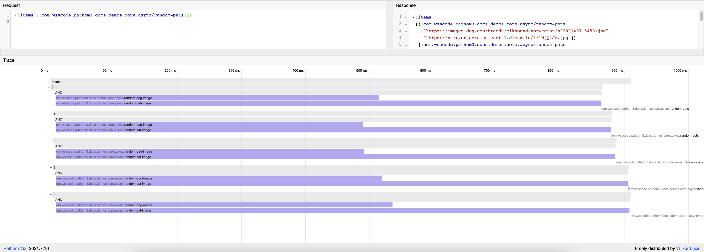
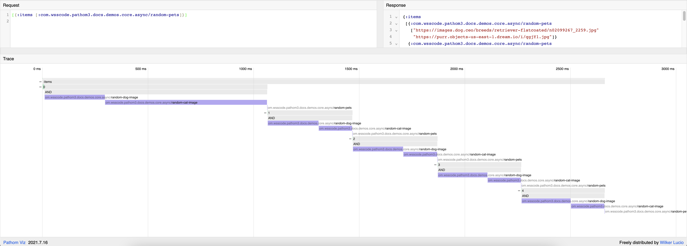

Async process allows Pathom to process resolvers that require async processing.

JS environments are limited without async support, you can't trigger HTTP or database
requests.

In this section, you will learn how to use the async features from Pathom 3.

## Promesa

Pathom 3 uses the [Promesa](https://github.com/funcool/promesa) library under the hood to manage the async process.

Promesa uses native [Promises](https://developer.mozilla.org/en-US/docs/Web/JavaScript/Reference/Global_Objects/Promise)
in Javascript environments, and [CompletableFuture](https://docs.oracle.com/en/java/javase/11/docs/api/java.base/java/util/concurrent/CompletableFuture.html)
on the JVM.

I'll use the term `future` to refer to both `Promises` and `CompletableFuture` in the
rest of this page.

## Async resolvers

Async resolvers are not unique. They use the same constructs as the other resolvers
you know so far.

The difference when you write an async resolver is that it may return a `future` from
the resolver, for example:

```clojure
(ns com.wsscode.pathom3.docs.demos.core.async
  (:require [com.wsscode.pathom3.connect.indexes :as pci]
            [com.wsscode.pathom3.connect.operation :as pco]
            [promesa.core :as p]))

(defn json-get [url]
  (p/let [resp (js/fetch url)
          json (.json resp)]
    (js->clj json :keywordize-keys true)))

(pco/defresolver age-from-name [{::keys [first-name]}]
  {::pco/output [::age]}
  (p/let [{:keys [age]} (json-get (str "https://api.agify.io/?name=" first-name))]
    {::age age}))
```

:::important
The `future` must be around the return map in the resolver. Returning futures as
values for the keys won't work. This is a bad example:

```clojure
(pco/defresolver age-from-name [{::keys [first-name]}]
  {::pco/output [::age]}
  ; return map
  {::age
   ; with key value as a promise, won't work
   (p/let [{:keys [age]} (json-get (str "https://api.agify.io/?name=" first-name))]
     age)})
```
:::

## Async EQL

To async, there is only the EQL interface. It behaves similar to the [EQL](eql.mdx)
standard interface, but returns a promise in the end.

Example usage:

```clojure {4,17-19,22-25}
(ns com.wsscode.pathom3.docs.demos.core.async
  (:require [com.wsscode.pathom3.connect.indexes :as pci]
            [com.wsscode.pathom3.connect.operation :as pco]
            [com.wsscode.pathom3.interface.async.eql :as p.a.eql]
            [promesa.core :as p]))

(defn json-get [url]
  (p/let [resp (js/fetch url)
          json (.json resp)]
    (js->clj json :keywordize-keys true)))

(pco/defresolver age-from-name [{::keys [first-name]}]
  {::pco/output [::age]}
  (p/let [{:keys [age]} (json-get (str "https://api.agify.io/?name=" first-name))]
    {::age age}))

(def env
  (pci/register
    age-from-name))

(comment
  (p/let [res (p.a.eql/process env
                {::first-name "Ada"}
                [::age])]
    (cljs.pprint/pprint res)))
```

## Async ENV

When using the async helpers, Pathom also supports the `env` being async.

This is useful when the environment build requires async operations. For example, in
a CLJS client, to integrate a remote Pathom service we need to request the index
async:

```clojure
(defn transit-request [url body]
  (p/let [resp (js/fetch url
                 #js {:method "POST"
                      :body   (tt/write-str body {:handlers pcot/write-handlers})})
          text (.text resp)]
    (tt/read-str text {:handlers pcot/read-handlers})))

(defn pathom-remote [request]
  (transit-request "https://name-server.com" request))

(def users
  {1 {:person/first-name "Alex"
      :person/last-name  "French Guy Cooking"}
   2 {:person/first-name "Denise"
      :person/last-name  "Mascarenhas"}})

; note now we make env a promise instead of a map
(def async-env
  (p/let [rem (pcf/foreign-register pathom-remote)]
    (pci/register
      [rem
       (pbir/static-table-resolver :person/id users)])))

;           use directly as env, supported by Pathom
(p/let [res (p.a.eql/process async-env
              {:person/id 2}
              [:person/full-name])]
  (js/console.log "!! " res))
```

## Parallel Process

In Parallel mode Pathom will run as many things at the same time as it can.

Example setup:

```clojure
(pco/defresolver random-dog-image []
  {::pco/output [::random-dog-image-url]
   ::pco/cache? false}
  (p/let [{:keys [message]} (json-get "https://dog.ceo/api/breeds/image/random")]
    {::random-dog-image-url message}))

(pco/defresolver random-cat-image []
  {::pco/output [::random-cat-image-url]
   ::pco/cache? false}
  (p/let [{:keys [file]} (json-get "https://aws.random.cat/meow")]
    {::random-cat-image-url file}))

(pco/defresolver random-pets [{::keys [random-dog-image-url
                                       random-cat-image-url]}]
  {::random-pets [random-dog-image-url
                  random-cat-image-url]})

(def parallel-env
  (-> {::p.a.eql/parallel? true}
      (pci/register
        [random-dog-image
         random-cat-image
         random-pets])))

(p.a.eql/process async-env
  {:items [{} {} {} {} {}]}
  [{:items
    [::random-pets]}])
```

In the previous example, we have 5 items and load a random dog and cat picture
for each. Using Pathom Viz we can see the items running in parallel:



Let's compare it with the serial runner:

```clojure
(def parallel-env
  (-> {::p.a.eql/parallel? false} ; disable parallel
      (pci/register
        [random-dog-image
         random-cat-image
         random-pets])))
```



Now you can see the cascading and each event running one after the other.

### Batching in parallel mode

In Parallel mode the batch process is different from the serial modes.

In serial mode, the batches run after scanning every entity on the query, to trigger
the items and resume each graph run.

In parallel, the notion of "scanning" isn't as clear and requires a different approach.

Instead of waiting for the end scan, Pathom will run batches based on time, it waits
for a window without any new entries and run.

The default wait time is 10ms, and you can change it setting via the
`:com.wsscode.pathom3.connect.runner.parallel/batch-hold-delay-ms` variable in your
environment.

You can also force a flush at a certain number of items collected for batching using
the `:com.wsscode.pathom3.connect.runner.parallel/batch-hold-flush-threshold`, the
default value is `nil`, which will make it flush only by time.

## Using core.async

To use core.async, we can extend the channel protocol to implement the conversion from
a core.async channel to a future.

I have made a [library](https://github.com/wilkerlucio/promesa-bridges) to share the implementation of this extension, this way we can
avoid issues when multiple people try to extend the same type.

First add promesa-bridges to your dependencies:

```clojure
{:deps {com.wsscode/promesa-bridges {:mvn/version "2021.01.20"}}}
```

Then include and use it:

```clojure
(ns com.wsscode.pathom3.docs.demos.core.async-extend-core-async
  (:require
    [clojure.core.async :as async :refer [go <!]]
    [com.wsscode.promesa.bridges.core-async]
    [com.wsscode.pathom3.connect.indexes :as pci]
    [com.wsscode.pathom3.connect.operation :as pco]
    [com.wsscode.pathom3.interface.async.eql :as p.a.eql]
    [promesa.core :as p]))

(pco/defresolver slow-resolver []
  {::pco/output [::slow-response]}
  ; returning a channel from resolver
  (go
    (<! (async/timeout 400))
    {::slow-response "done"}))

(def env (pci/register slow-resolver))

(comment
  (p/let [res (p.a.eql/process env [::slow-response])]
    (cljs.pprint/pprint res)))
```

If you like to add more extensions to `promesa-bridges`, please send a pull request.
