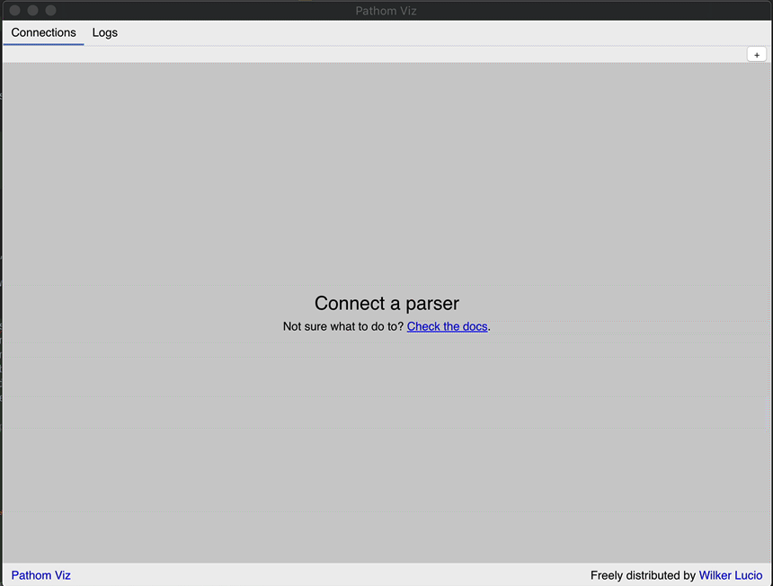
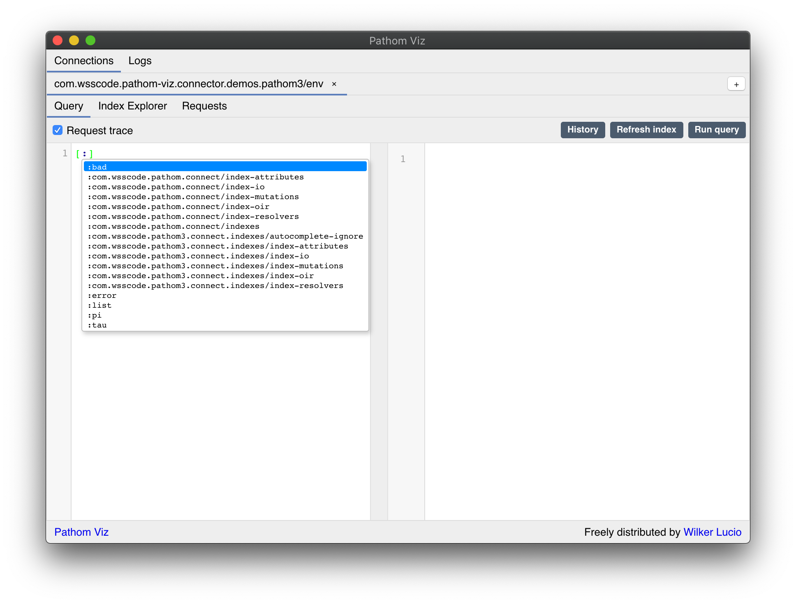
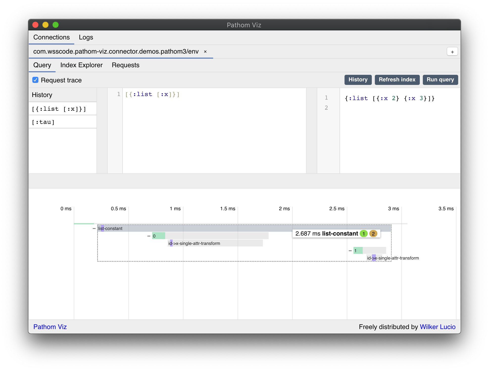
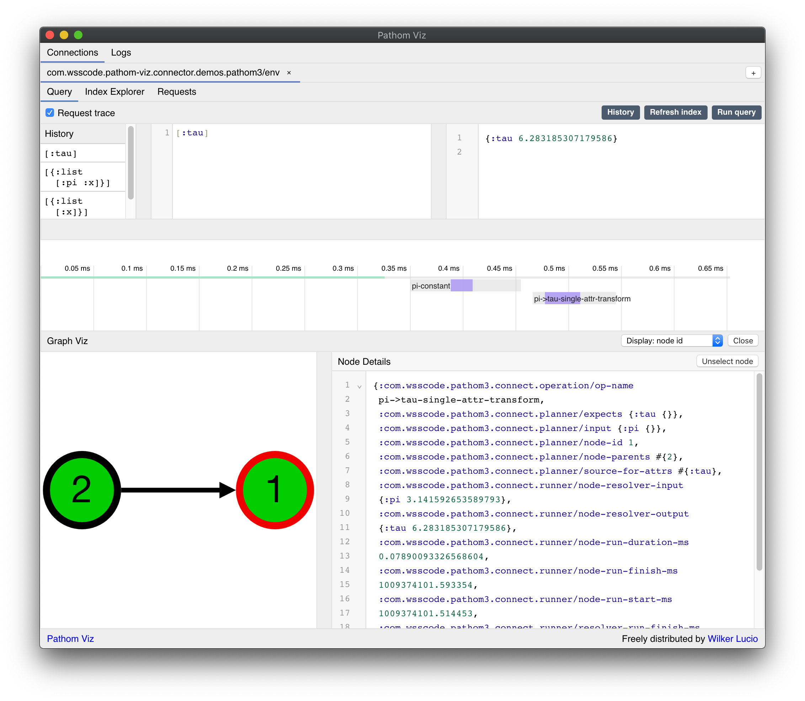
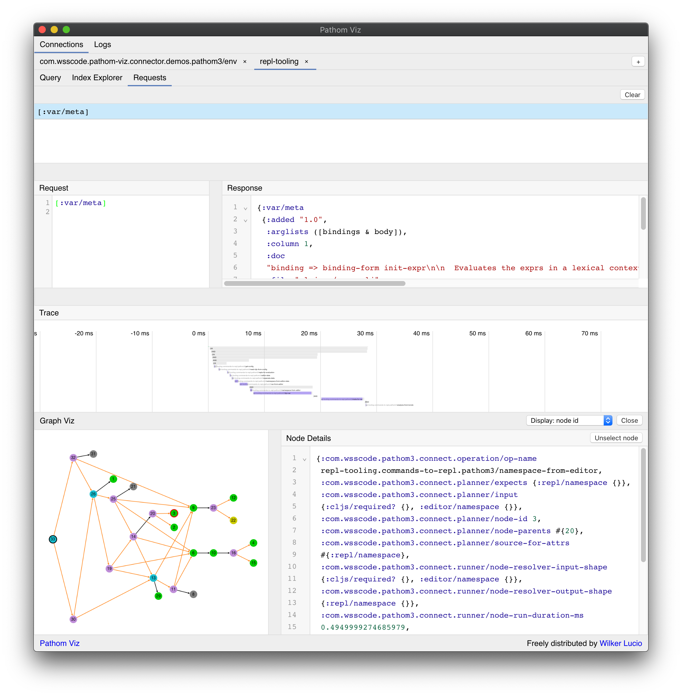

In this page you will find information on how to debug problems using Pathom 3.

## Things that can go wrong

Here is a list of common problems you may face when using Pathom:

- You expected some data, and it didn't show up in your result map.

## REPL debug

## Result not appearing

Once you are querying, Pathom hides the complexity of the that process. When results
are unexpected, then we need to see inside the complexity. In this page you will
learn about the tools that Pathom provides to empower you to find out what's going on.

## Pathom Run Stats

When Pathom runs, on top of generating your response, it also generates some data
about what happened. This data includes the plan generate for your request, and some
details about what happened to run each node in this graph.

You can find this data living the `meta` data of the returned map, this works for the
[EQL](eql.mdx) interface and if you use the runner directly. To see this data with
[Smart Maps](smart-maps.mdx) you should use the `psm/get-with-stats` helper.

Let's have a look what is inside this data, this is our source example:

```clojure
(pco/defresolver area [{:keys [width height]}]
  {:area (* width height)})

(pco/defresolver width [{:keys [x x2]}]
  {:width (- x2 x)})

(def env
  (pci/register
    [area width]))

(p.eql/process
  env
  {:x 10 :x2 30 :height 40}
  [:area])
```

The result map is `{:area 800}`. Now let's look at what is in `meta`:

```clojure
{::pcr/run-stats
 {::pcr/compute-plan-run-start-ms
  3.701837395085457E9

  ::pcr/compute-plan-run-finish-ms
  3.701837397421086E9

  ::pcr/graph-run-start-ms
  3.701837395080634E9

  ::pcr/graph-run-finish-ms
  3.701837399062158E9

  ::pcr/node-run-stats
  {2
   {::pcr/resolver-run-start-ms  3.701837397955496E9
    ::pcr/resolver-run-finish-ms 3.701837397997367E9
    ::pcr/node-run-input         {:x 10, :x2 30}
    ::pcr/node-run-output        {:width 20}}
   1
   {::pcr/resolver-run-start-ms  3.701837398639112E9
    ::pcr/resolver-run-finish-ms 3.701837398674007E9
    ::pcr/node-run-input         {:width 20, :height 40}
    ::pcr/node-run-output        {:area 800}}}

  ::pcp/index-ast
  {:area {:type :prop, :dispatch-key :area, :key :area}}

  ::pcp/index-attrs
  {:width 2, :area 1}

  ::pcp/index-resolver->nodes
  {com.wsscode.pathom3.demos.troubleshoot/area  #{1}
   com.wsscode.pathom3.demos.troubleshoot/width #{2}}

  ::pcp/root
  2

  ::pcp/nodes
  {1
   {::pco/op-name          com.wsscode.pathom3.demos.troubleshoot/area
    ::pcp/node-id          1
    ::pcp/expects          {:area {}}
    ::pcp/input            {:width {}, :height {}}
    ::pcp/node-parents     #{2}
    ::pcp/source-for-attrs #{:area}}
   2
   {::pco/op-name          com.wsscode.pathom3.demos.troubleshoot/width
    ::pcp/node-id          2
    ::pcp/expects          {:width {}}
    ::pcp/input            {:x {}, :x2 {}}
    ::pcp/source-for-attrs #{:width}
    ::pcp/run-next         1}}}}
```

:::tip
Note we have a mix of `::pcp` (planner) and `::pcr` (runner) keys in this map root. The
namespace is an indication of what part of the system owns that key.
:::

You can find information about the planner keys at the [planner documentation page](planner.mdx).

On top of the plan data, the runner data includes a few timestamps (in precision timing)
to know about duration and relative time of execution.

Last but most important, the `::pcr/node-run-stats` contains the times and node execution
data for each node. Look at it to check if your information flows as expected.

## Debug with Pathom Viz

<div className="pathom-diagram">

  

</div>

[Pathom Viz](https://github.com/wilkerlucio/pathom-viz/) is a developer app created to
assist in the development with Pathom. In Pathom Viz you can:

- Run queries with auto-complete feature in the tool editor
- Trace the requests to understand the bottlenecks of the process
- Explore the app index with Index Explorer
- Track all requests made to your app, and see trace details of those

### Download the app

You can download Pathom Viz at the [releases page](https://github.com/wilkerlucio/pathom-viz/releases/).

#### Mac OS Notes

Notice that I don't have an Apple ID so I can't sign the app on the Mac version, to run the app:

- Download the `.dmg` file
- Open and drag pathom to the Applications
- Open the Applications folder on finder
- Attempt to open the app (you will see a message saying the app isn't signed, options to delete or cancel)
- Right click on it and click open (this is important, don't just double-click on it)
- It may show the `Open` button on the dialog, if not, repeat the previous step, and it should appear

#### Windows Notes

There is not build for Windows because I can't figure how to get the CI to compile in
this environment, one limitation is that the Clojure runner available for Github Actions
doesn't support Clojure deps.

To run on Windows you must download and build it yourself. Follow the [build instructions](https://github.com/wilkerlucio/pathom-viz#building-the-app)
on the README to do so.

### Connect the App

The next step is to connect your [environment](environment.mdx) with the app.

First you have to include the [Pathom Viz Connector](https://github.com/wilkerlucio/pathom-viz-connector)
dependency to your project:

```clojure
{:deps {com.wsscode/pathom-viz-connector
        {:mvn/version "2021.01.25"}}}
```

:::tip
You can also do it with a local deps aliases:

```clojure
{:aliases
 {:dev/pathom-tools
  {:extra-deps
    {com.wsscode/pathom-viz-connector
     {:mvn/version "2021.01.25"}}}}}
```
:::

If you didn't open the Pathom Viz app yet, do it now.

Then, set up your environment to connect with the app:

```clojure
(ns com.wsscode.pathom-viz.connector.demos.pathom3
  (:require [com.wsscode.pathom.viz.ws-connector.core :as pvc]
            [com.wsscode.pathom.viz.ws-connector.pathom3 :as p.connector]
            [com.wsscode.pathom3.connect.built-in.resolvers :as pbir]
            [com.wsscode.pathom3.connect.indexes :as pci]
            [com.wsscode.pathom3.interface.eql :as p.eql]))

; you can use goog.defines on ClojureScript or env vars in Clojure
; the important part is to have a flag to decide when to connect the parser
(def CONNECT_PARSER? true)

(def registry
  [(pbir/constantly-resolver :pi Math/PI)
   (pbir/single-attr-resolver :pi :tau #(* 2 %))])

(def env
  (cond-> (pci/register registry)
    CONNECT_PARSER?
    ; give your environment a unique parser-id, this will ensure reconnects work as
    ; expected
    (p.connector/connect-env {::pvc/parser-id `env})))

(comment
  (p.eql/process env
    [:tau]))
```

:::note
The attribute name `::pvc/parser-id` is an inheritance from Pathom 2, keeping this
name for compatibility.
:::

Once you load this file, you should see a new tab appearing in Pathom Viz:

<div className="pathom-diagram">

  

</div>

### Query Editor

The query editor provides an environment to run queries using your connected environment.

<div className="pathom-diagram">

  

</div>

The query editor provides auto-complete for exploration:

<div className="pathom-diagram">

  

</div>

The auto-complete is contextual. This means depending on which part of the query you are,
Pathom Viz will offer different attribute suggestions.

When you run a query, the result will appear on the right, and the query is saved to
a query history.

Bellow the results there is the trace viewer, described in the next section.

### Tracer View

The tracer view displays a timeline of the things that happened during the query process.

<div className="pathom-diagram">

  

</div>

#### Trace blocks

Each gray block in the timeline can be one of:

1. A graph process: the first short bar is one, but also when a process trigger sub-processes, each sub-process has its own graph bar
2. Node execution: these bars go below the graph process, and represent the execution of a node in the graph

Inside the bars will you see events that covers part of it.

:::tip
Mouse over the events to see more details and precise durations of each.

In that hint you can see the times for each event under the mouse. You will also see
one or two badges on the right side.

The green one is the number of events in that block. The yellow one
tells how many direct children this block has (this is absent when the number of
children is zero).
:::

You will see some different colors filling the blocks, these are their meaning:

- Green: generic events
- Purple: resolver call
- Red: failed operation
- Blue: batch resolver call

#### Nested traces

When Pathom process a sub-query, that nested details is put below the block they
happened. In this case you will see a `+` OR `-` icon on the left side of the block.

Use this to toggle the visibility of the children blocks.

<div className="pathom-diagram">

  

</div>

When you mouse over a block with children, Pathom Viz creates a box around that, to
make easier to see the boundaries of it.

#### View the graph

By clicking on a block you can see the node of that block, and the plan in which it
was projected. This will open the Graph View, described in the next section.

### Graph View

When you click on a block in the Trace View it opens the graph view below it:

<div className="pathom-diagram">

  

</div>

This graph represents what the [planner](planner.mdx) generated for this execution.

If you clicked on a graph block, the graph opens without any node selected. In case
you clicked on a node block, that nodes starts in focus on the graph, marked by a red
border.

You will see different colors for nodes, here are their meaning:

- Green: a node executed with success
- Gray: a node that didn't run
- Yellow: a node that ran, but got an empty response
- Red: a node that failed to run
- Purple: `AND` node
- Blue: `OR` node

A node with a black border means it's the root of the graph.

There is also different kinds of edges between the nodes:

- Orange edges: these happen on `AND` and `OR` nodes, it means the branches of this composing node
- Black edge: means the node to run after the current node. In the cases of branch nodes, the branches runs first, and then the next runs.

When a node is selected its details show up on the right side of the graph. The details
is the map with all node information available.

The following graph is a more complex example that has all most of the node types and
edges (there is no failed nodes in this example):

<div className="pathom-diagram">

  

</div>

### Index Explorer

In this panel you can explore the attributes, resolvers and mutations of your graph.

To learn about this please [check the previous index explorer docs](https://blog.wsscode.com/pathom/v2/pathom/2.2.0/connect/exploration.html).
The behavior of them in Pathom 3 is the same as in Pathom 2. This view may evolve in
the future to support more of the features from Pathom 3.

### Requests

The requests tab is where you can see a log of the requests made to your environment.

This view is very much like the Query Editor, without the editing part.

<div className="pathom-diagram">

  

</div>

You can see trace and graph view in the same way as in the Query Editor.
