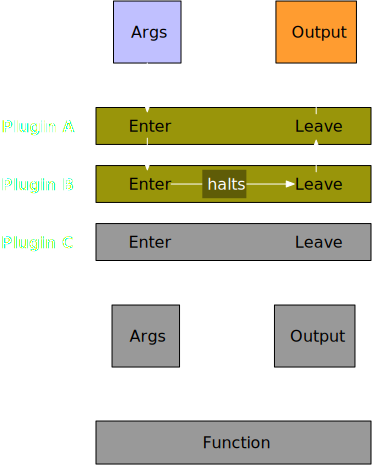

Plugins provide a way to extend Pathom behavior. This page explains how Pathom plugins
work and how you can write your extensions.

## The wrapping model of plugins

Pathom extensions work by `wrapping` code points in Pathom. This means you can code
around the extended points in Pathom.

Each extension point has an identifier keyword.

Let's take for example the `:com.wsscode.pathom3.format.eql/wrap-map-select-entry`
extension. This adds a hook to the result masking operation, which occurs at the
end of `p.eql/process` to filter out the results according to the query.

:::note
It's a Pathom convention to prefix all plugin wrapping attributes with `wrap-`.
:::

This hook, in specific, can control how the value is placed at the resulting map.

Let's use this hook to make an extension that protects certain attributes from getting
in the output map:

```clojure
(ns com.wsscode.pathom3.docs.demos.core.plugins
  (:require [com.wsscode.misc.coll :as coll]
            [com.wsscode.pathom3.connect.built-in.resolvers :as pbir]
            [com.wsscode.pathom3.connect.indexes :as pci]
            [com.wsscode.pathom3.interface.eql :as p.eql]
            [com.wsscode.pathom3.plugin :as p.plugin]))

(def protected-attributes
  #{:user/password})

; define the extension wrapper fn
(defn protect-attributes-wrapper [mst]
  (fn [env source {:keys [key] :as ast}]
    (if (and (contains? source key)
             (contains? protected-attributes key))
      ; the output of this extension must be a map entry or nil
      ; a vector with two elements would also work, but creating a map entry is
      ; more efficient
      (coll/make-map-entry key ::protected-value)
      (mst env source ast))))

; create the plugin
(p.plugin/defplugin protect-attributes-plugin
  {:com.wsscode.pathom3.format.eql/wrap-map-select-entry
   protect-attributes-wrapper})

(def users
  {1 {:user/id       1
      :user/name     "User Name"
      :user/password "12345"}})

(def env
  (-> (p.plugin/register protect-attributes-plugin)
      (pci/register [(pbir/static-table-resolver :user/id users)])))

(p.eql/process env
  '[{[:user/id 1]
     [:user/name :user/password]}])
; => {[:user/id 1]
;     {:user/name     "User Name",
;      :user/password ::protected-value}}
```

Now let's talk in more detail about the things we used in this example.

### Define the wrapper fn

A more generic way to think about wrapper extensions is with the following structure:

```clojure
(defn wrapper-fn [original-fn]
  ; the number of args in the internal-impl depends on which function the plugin is wrapping
  (fn internal-impl [args]
    ; here we are wrapping the original fn, we can both alter its arguments or the return
    ; of it, you can think of the code before the original-fn as the ENTER part, and
    ; the code after (possibly modifying the output) as the LEAVE part.
    (original-fn args)))
```

### Define the plugin

Then, a plugin consists of one or more of those wrapping functions. Any map can be a
plugin, to make it a plugin, you must add the key `::p.plugin/id` with a symbol to
identify this plugin. Then each other key is an extension wrapper.

```clojure
; using defplugin it defines the var and adds the id to the map
(p.plugin/defplugin protect-attributes-plugin
  {:com.wsscode.pathom3.format.eql/wrap-map-select-entry
   my-wrapper})

; this is how to do the same thing without the macro:
(def protect-attributes-plugin
  {::p.plugin/id
   `protect-attributes-plugin

   :com.wsscode.pathom3.format.eql/wrap-map-select-entry
   my-wrapper})
```

The latter form is interesting when you are generating a plugin programmatically.

For example, we could make our plugin to protect attributes more configurable by using
making a function that returns the plugin:

```clojure
(defn protect-attributes-plugin [protected-attributes]
  {::p.plugin/id
   `protect-attributes-plugin

   :com.wsscode.pathom3.format.eql/wrap-map-select-entry
   (fn [mst]
     (fn [env source {:keys [key] :as ast}]
       (if (and (contains? source key)
                (contains? protected-attributes key))
         ; the output of this extension must be a map entry or nil
         ; a vector with two elements would also work, but creating a map entry is
         ; more efficient
         (coll/make-map-entry key ::protected-value)
         (mst env source ast))))})

(def env
  ; create plugin to protect specific attributes and add it
  (-> (p.plugin/register (protect-attributes-plugin #{:user/password}))
      (pci/register [(pbir/static-table-resolver :user/id users)])))
```

## Adding plugins

To use a plugin, you must add it to the environment using the `p.plugin/register` function.

This function works similar to `pci/register` and also accepts vectors
of plugins.

In the case of plugins, there is also `p.plugin/register-before` and
`p.plugin/register-after`. Which gives you more control over the plugin execution order.

In the next section, we will talk more about plugin order.

### Plugin order

To understand the order in which plugins execute, it helps to keep the following image
in your head:

<div className="pathom-diagram">

  

</div>

Here is the same description as code:

```clojure
; register in a single call
(p.plugin/register
  [plugin-a
   plugin-b
   plugin-c])

; in many calls, same result:
(-> {}
    (p.plugin/register plugin-a)
    (p.plugin/register plugin-b)
    (p.plugin/register plugin-c))
```

Plugins on top will enter first and leave last.

:::tip
You can view the plugin order in the attribute `::p.plugin/plugin-order` attribute in
your environment.
:::

A plugin can halt the execution of the posterior plugins (and the original operation
itself). This happens when the plugin returns some data without calling the original
function given on the wrapper.

For example, if `plugin-b` halts execution (like our protected attributes plugin does)
the stack stops there and goes back up. The following image illustrates this case:

<div className="pathom-diagram">

  

</div>

Consider this when deciding the order of plugins.

:::important
When you use `p.plugin/register`, Pathom creates specific lists for each plugin type. This way, it only has to iterate over plugins of that extension type.
:::

## Extension points

Here you can see all the extension points available in Pathom.

### Runner Extensions

Extensions available for the runner process of Pathom at `com.wsscode.pathom3.connect.runner`
namespace.

#### `::pcr/wrap-resolve`

Wrap the call of a resolver.

```clojure
(defn sample-resolve-wrapper [resolve]
  (fn [env node]
    (resolve env node)))
```

#### `::pcr/wrap-mutate`

Wrap the call of a mutation.

```clojure
(defn sample-mutate-wrapper [mutate]
  (fn [env ast]
    (mutate env ast)))
```

#### `::pcr/wrap-resolver-error`

Wrap the operation that attaches an error to a node.

```clojure
(defn sample-resolver-error-wrapper [original]
  (fn [env node error]
    (original env node error)))
```

#### `::pcr/wrap-merge-attribute`

Wrap the operation of merging new data in the entity. This is an important point. You
can control how sub-processes occur here. The source original is an `assoc` like operation.

```clojure
(defn sample-merge-attribute-wrapper [original]
  (fn [env out k v]
    (original env out k v)))
```

#### `::pcr/wrap-run-graph!`

Wrap the operation of running a graph. Note for a given transaction, there may be many
graphs to run. Each entity (each map in the result) is potentially an entity and may
have its own graph.

```clojure
(defn sample-run-graph-wrapper [original]
  (fn [env ast-or-graph entity-tree*]
    (original env ast-or-graph entity-tree*)))
```

In case you want to run something only at the root graph you can use the `p.path/root?`
helper:

```clojure
(defn sample-run-graph-wrapper [original]
  (fn [env ast-or-graph entity-tree*]
    (if (p.path/root? env)
      (do-something-at-root))
    (original env ast-or-graph entity-tree*)))
```

### EQL Output

#### `::pf.eql/wrap-map-select-entry`

This is the one we used for the initial demo. Controls how outputs get masked out in
the post-processing of the EQL output.

```clojure
(defn sample-map-select-entry-wrapper [original]
  (fn [env source ast]
    (original env source ast)))
```
