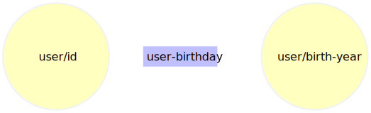
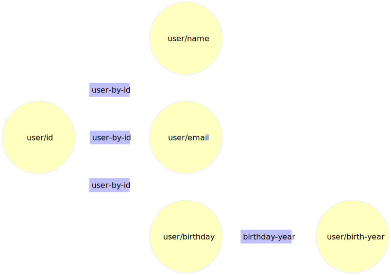
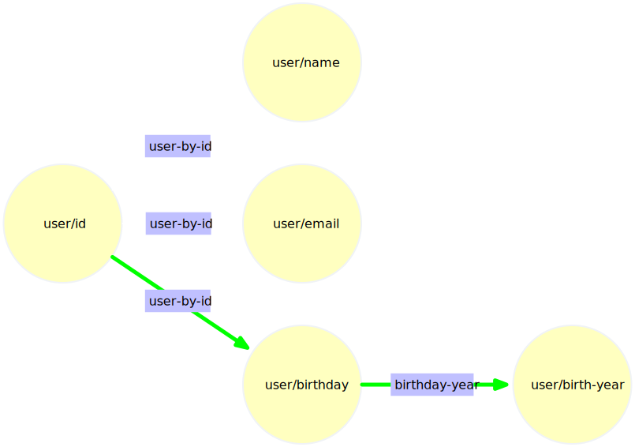

Resolvers are the primary building blocks in Pathom. They are the constructs to express
relationships between attributes.

On this page, you will learn how to create resolvers and use them. After that you
will learn about the built-in resolvers that come with Pathom.

## What is a resolver in Pathom?

The Pathom engine gathers its resolution features from the relationship between attributes.
Resolvers are the piece that expresses those relationships.

To put in more concrete terms, imagine that you have some user id, and you want to know
the user's birth year. In Pathom, we express this relationship using the attributes
`:acme.user/id` and `:acme.user/birth-year` for example.

Now we need to implement how to fetch the name from the id, this can be a lookup in a
database, or a map, or any other way, doesn't matter. What matters is that you express
this connection and provide code that makes it happen.

Here I'll illustrate this using a map lookup:

```clojure
(def user-birthdays
  {1 1969
   2 1954
   3 1986})

; defresolver is the main option to create new resolvers
(pco/defresolver user-birthday [{:keys [acme.user/id]}]
  {:acme.user/birth-year (get user-birthdays id)})
```

In Pathom, resolvers represent edges in a graph. As illustrated in the following figure:

<div className="pathom-diagram">

  

</div>

:::note
I made the names short on the diagrams for space, but keep your domain qualifiers long.
:::

This example was a simplification; most systems will store the full birth date instead,
and then extract the year from this date.

We can simulate such case using the following setup:

```clojure
; define a map for indexed access to user data
(def users-db
  {1 #:acme.user{:name     "Usuario 1"
                 :email    "user@provider.com"
                 :birthday "1989-10-25"}
   2 #:acme.user{:name     "Usuario 2"
                 :email    "anuser@provider.com"
                 :birthday "1975-09-11"}})

; pull stored user info from id
(pco/defresolver user-by-id [{:keys [acme.user/id]}]
  {::pco/output
   [:acme.user/name
    :acme.user/email
    :acme.user/birthday]}
  (get users-db id))

; extract birth year from birthday
(pco/defresolver birth-year [{:keys [acme.user/birthday]}]
  {:acme.user/birth-year (first (str/split birthday #"-"))})
```

Here is a diagram from the previous setup:

<div className="pathom-diagram">

  

</div>

Given that image, let's consider that we know about some user id and want to know
this user birthday, we can reach that using the path highlighted in the next diagram:

<div className="pathom-diagram">

  

</div>

Here I'll show you one way of doing a request like this, using the Pathom EQL interface:

```clojure
; process needs an environment configuration
(p.eql/process env
  ; we can provide some initial data
  {:acme.user/id 1}
  ; then we write an EQL query
  [:acme.user/birth-year])
; => {:acme.user/birth-year "1989"}
```

So resolvers establish edges in the Pathom graph, allowing Pathom to traverse from
some source data to some target data. In the rest of this documentation, you will learn
how to define resolvers.

## Using `defresolver`

The macro `defresolver` is the primary way to create new resolvers. It has some sugars
to reduce the boilerplate code related to define a new resolver.

The main pieces of a resolver are:

- `::pco/op-name` - a symbol that identify the resolver, like a function name.
- `::pco/output` - a EQL expression that informs the attributes **provided** by this resolver.
- `::pco/input` - a EQL expression that informs the attributes **required** by this resolver.

:::important
Both input and output can express flat or nested queries, you should always strive to
be as precise with these descriptions as you can (matching the shapes of your inputs and
outputs), Pathom leverages this information in many ways during transaction processing,
and as more accurate you get, the more Pathom can do with it.
:::

Let's start with a verbose usage of `defresolver` to go over these main pieces:

```clojure
; this resolver computes a slug to use on URL from some article title
(pco/defresolver article-slug [env {:acme.article/keys [title]}]
  {::pco/op-name `article-slug
   ::pco/input   [:acme.article/title]
   ::pco/output  [:acme.article/slug]}
  {:acme.article/slug (str/replace title #"[^a-z0-9A-Z]" "-")})
```

:::note Design observation
This resolver expresses an edge in Pathom attribute world. It says the attribute `:acme.article/slug`
is reachable, given that a `:acme.article/title` is available.
:::

If you look close, you can find a fair amount of repetition in this expression:
- The `op-name` is repeated at the start to define the `var` name.
- The `input` is repeated in the destructuring expression.
- The `output` is visible in the output expression.

Experience with Pathom 2 demonstrated these repetitions occur frequently in most Pathom
code bases. So Pathom 3 adds some extra sugar tricks to avoid the repetition:

1. We can remove the `::pco/op-name` and let `defresolver` use the same symbol as the `var`:

```clojure
(pco/defresolver article-slug [env {:acme.article/keys [title]}]
  {::pco/input  [:acme.article/title]
   ::pco/output [:acme.article/slug]}
  {:acme.article/slug (str/replace title #"[^a-z0-9A-Z]" "-")})
```

:::tip
If you use [Cursive](https://cursive-ide.com/), you can ask it to resolve the
`pc/defresolver` as a `defn`, and you will get proper symbol resolution
:::

2. Now, given the `input` is the same as destructuring, we can let `defresolver` infer the input from it:

```clojure
(pco/defresolver article-slug [env {:acme.article/keys [title]}]
  {::pco/output [:acme.article/slug]}
  {:acme.article/slug (str/replace title #"[^a-z0-9A-Z]" "-")})
```

:::note
You can also use destructuring via symbol binding, for example, this works the same:

```clojure
(pco/defresolver article-slug [env {title :acme.article/title}]
  {::pco/output [:acme.article/slug]}
  {:acme.article/slug (str/replace title #"[^a-z0-9A-Z]" "-")})
```
:::

3. Since the last element of our expression is a map, `defresolver` can infer the `output` from it:

```clojure
; given the map would be empty now, we can remove it completely
(pco/defresolver article-slug [env {:acme.article/keys [title]}]
  {:acme.article/slug (str/replace title #"[^a-z0-9A-Z]" "-")})
```

:::important
Pathom only looks at the last item of the body for implicit outputs. This means that
if you wrap the map with something like a `let` statement, Pathom will not be able
to figure it out. Instead, you can move the `let` down on the attribute level:

```clojure
(pco/defresolver foo []
  ; infer won't work, the last statement is a let
  (let [x 10]
    {:foo x}))

(pco/defresolver foo []
  ; works
  {:foo (let [x 10] x)})
```

In the future, Pathom may get smarter around this, but this is a long rabbit role when
I consider that the last user statement may be an `if`, `cond`, etc...
:::

:::note
Although Pathom can infer the configuration, you can always override it using the
options map.
:::

4. Given we are not using `env`, we can also take it out, taking us to the final version:

```clojure
(pco/defresolver article-slug [{:acme.article/keys [title]}]
  {:acme.article/slug (str/replace title #"[^a-z0-9A-Z]" "-")})
```

:::tip
In case you have a resolver that doesn't use an input, you can omit the first argument
as well, for example:

```clojure
(pco/defresolver constant-pi []
  {:acme.math/pi 3.1415})
```
:::

## Invoking resolvers

Like functions, you can call the resolvers directly. The arity to call resolver is similar
to how to define resolvers:

```clojure
(pco/defresolver extension [{::keys [path]}]
  {::path-ext (last (str/split path #"\."))})

(extension {::path "foo.txt"})
; => {::path-ext "txt"}
```

This makes it easier to test resolvers in unit tests.

Outside of the test context, you should have little reason to invoke a resolver directly. What
sets resolvers apart from regular functions are that it contains data about its requirements
and what it provides.

This allows you to abstract away the operation names and focus only on the attributes.

To illustrate the difference, let's compare the two approaches, first let's define the resolvers:

```clojure
(ns com.wsscode.pathom.docs.resolvers-demos
  (:require [clojure.string :as str]
            [com.wsscode.pathom3.connect.built-in.resolvers :as pbir]
            [com.wsscode.pathom3.connect.indexes :as pci]
            [com.wsscode.pathom3.connect.operation :as pco]
            [com.wsscode.pathom3.interface.smart-map :as psm]))

(def user-from-id
  (pbir/static-table-resolver `user-db :acme.user/id
    {1 #:acme.user{:name  "Trey Parker"
                   :email "trey@provider.com"}
     2 #:acme.user{:name  "Matt Stone"
                   :email "matt@provider.com"}}))

; avatar slug is a version of email, converting every non letter character into dashes
(pco/defresolver user-avatar-slug [{:acme.user/keys [email]}]
  {:acme.user/avatar-slug (str/replace email #"[^a-z0-9A-Z]" "-")})

(pco/defresolver user-avatar-url [{:acme.user/keys [avatar-slug]}]
  {:acme.user/avatar-url (str "http://avatar-images-host/for-id/" avatar-slug)})
```

Consider the question: What is the `avatar url` of the user with id `1`.

The traditional way to get there using our resolvers as functions goes as:

```clojure
(-> {:acme.user/id 1}
    (user-from-id)
    (user-avatar-slug)
    (user-avatar-url)
    :acme.user/avatar-url)
; => "http://avatar-images-host/for-id/trey-provider-com"
```

Now check a few examples of how we can accomplish the same using the a [smart map](smart-maps.mdx)
leveraged by the resolvers meta-data:

```clojure
; first, we build an index for the relations expressed by the resolvers
(def indexes
  (pci/register [user-from-id
                 user-avatar-slug
                 user-avatar-url]))

; now instead of reference the functions, we let Pathom figure them out using the indexes
(->> {:acme.user/id 2}
     (psm/smart-map indexes)
     :acme.user/avatar-url)
; => "http://avatar-images-host/for-id/matt-provider-com"

; to highlight the fact that we disregard the function, other ways where we can change
; the initial data and reach the same result:
(->> {:acme.user/email "other@provider.com"}
     (psm/smart-map indexes)
     :acme.user/avatar-url)
; => "http://avatar-images-host/for-id/other-provider-com"

(->> {:acme.user/avatar-slug "some-slogan"}
     (psm/smart-map indexes)
     :acme.user/avatar-url)
; => "http://avatar-images-host/for-id/some-slogan"
```

Note how as we change the input, Pathom adjusts the resolvers required to call, this
is the main thing that Pathom brings to you, **it removes the chore of knowing the
function names**, so you can focus on the data you have and need, instead of how to
get it.

### Using the indexes

Here we will cover in more detail the process to generate the indexes from resolvers.

Think of resolvers as the **atomic blocks of Pathom**, which are annotated functions. If Pathom had to scan
every resolver to figure a path, it would be slow. So instead, Pathom works on indexes
generated from a set of resolvers.

To generate the indexes, we use the function `(pci/register ...)`. The values allowed
on `register` are:

- resolvers
- mutations
- indexes
- sequence of previous items (recursively)

Here are a couple of examples to illustrate:

```clojure
; create indexes for a single resolver
(def single-registry (pci/register some-resolver))

; creating indexes with a few resolvers
(def many-registry (pci/register [resolver-a resolver-b]))

; define a group of resolvers in a variable
(def some-resolvers [res-a res-b])

; now use in combination with other mixes:
(def more-registry
  (pci/register [some-resolvers
                 [other-group with-more
                  [deep-nested resolvers]]
                 and-more]))

; now using indexes as part of registry
(def with-indexes (pci/register [some-resolvers many-registry]))

; all together now
(def env
  (pci/register [[resolver-a resolver-b]
                 some-resolvers
                 many-registry]))
```

To learn more details about the indexes, check the [indexes page](indexes.mdx).

With the `indexes` at hand you can leverage the Pathom engine to call the resolvers for you.

:::tip
The `indexes` are part of the Pathom environment, for some operations just the indexes
are enough. When you see `indexes` or `env`, consider they expect to have at least
the indexes for the resolvers in the map.
:::

For this you may use one of the Pathom 3 interfaces like [Smart Maps](smart-maps.mdx) or
[EQL](eql.mdx). Visit those pages if you like to see examples of how to use the Pathom
engine.

## Optional inputs

You can declare to Pathom that a resolver input is optional. To do so, you can use the
helper `pco/?` around the attribute.

:::note
In practice, this helper adds an EQL param to the keyword, noting it as optional.
:::

For this example you can see a resolver that tells how to call the user (for some gretting
message on a site for example). We call this attribute `:user/display-name`. All users
have emails, but not all users have their names in our database, so to create the
resolver for `:user/display-name` we make the `:user/name` attribute optional:

```clojure
(pco/defresolver user-display-name
  [{:user/keys [email name]}]
  {::pco/input [:user/email (pco/? :user/name)]}
  {:user/display-name (or name email)})

(def opt-env
  (pci/register
    [(pbir/static-table-resolver :user/id
       {1 {:user/email "user@example.com"}
        2 {:user/email "another@example.com"
           :user/name  "Sam"}})
     (pbir/constantly-resolver :all-users
       [{:user/id 1}
        {:user/id 2}
        {:user/id 3}])
     user-display-name]))

(p.eql/process opt-env
  [{:all-users [:user/display-name]}])
; => {:all-users
;     [{:user/display-name "user@example.com"} ; no name, use email
;      {:user/display-name "Sam"} ; has name (the optional), use it
;      {} ; user 3 doesn't exist, so resolver didn't get called
;     ]}
```

## Nested inputs

Pathom supports requiring nested inputs on a resolver. This feature is handy when you
need to make data aggregation based on indirect data.

To illustrate this, consider the following setup:

```clojure
(pco/defresolver top-players
  "Return maps with ids for the top players in a given game."
  []
  {:game/top-players
   [{:player/id 1}
    {:player/id 20}
    {:player/id 8}
    {:player/id 2}]})

(pco/defresolver player-by-id
  "Get player by id, in our case just generate some data based on the id."
  [{:keys [player/id]}]
  {:player/name (str "Player " id)
   :player/score (* id 50)})
```

Now, for the task: how to make a resolver that computes the average score from the top
players?

If you use the flat inputs as we did before and ask for `:game/top-players` it will
contain the ids, but not the scores. To make the scores available, a nested processing
is required in this case, and this where nested inputs come to rescue:

```clojure
(pco/defresolver top-players-avg
  "Compute the average score for the top players using nested inputs."
  [{:keys [game/top-players]}]
  ; we have to make the nested input explicit
  {::pco/input [{:game/top-players [:player/score]}]}
  {:game/top-players-avg-score
   (let [score-sum (transduce (map :player/score) + 0 top-players)]
     (double (/ score-sum (count top-players))))})

(p.eql/process (pci/register [top-players player-by-id top-players-avg])
  [:game/top-players-avg-score])
; => #:game{:top-players-avg-score 387.5}
```

When Pathom is planning, it will verify if a sub-query part reachable. If there is
no available path to fulfill the nested part, the planner will discard that path, avoiding
running unnecessary work on the runner.

You can try this by asking for a nested property that doesn't exist.

## Parameters

Parameters are a secondary layer to send information to a resolver. One main difference
between params and inputs is that params do not participate in the graph traversal; they
come as-is.

You can use parameters to allow the user to configure the request for some attribute.

To illustrate, lets start with a resolver that pulls todo from some mock memory data:

```clojure
(def mock-todos-db
  [{::todo-message "Write demo on params"
    ::todo-done?   true}
   {::todo-message "Pathom in Rust"
    ::todo-done?   false}])

(pco/defresolver todos-resolver [env _]
  ; express nested shape
  {::pco/output
   [{::todos
     [::todo-message
      ::todo-done?]}]}
  {::todos mock-todos-db})

(def env (pci/register todos-resolver))

; list all todos
(pf.eql/process env [::todos])
```

:::note
We are using explicit output in the `todos-resolver` so Pathom has more information about
the structured shape. Although the resolver works without the nested specification, having
it makes it possible for tools to auto-complete better, and this is important when
trying to integrate Pathom indexes, so as a general practice, when resolvers have nested
data, it's better always to specify it.
:::

To add params to a query attribute, we can use [EQL params](https://edn-query-language.org/eql/1.0.0/specification.html#_parameters),
for example:

```clojure
; list undone todos:
(pf.eql/process env ['(::todos {::todo-done? false})])
```

If we just ran the previous code, nothing happens. To make this work, we need to use
the parameters to filter the data in the resolver code.

To pull the params we can use the helper `(pco/params env)`, then filter the list based
on it:

```clojure {14-18,22-24}
(def mock-todos-db
  [{::todo-message "Write demo on params"
    ::todo-done?   true}
   {::todo-message "Pathom in Rust"
    ::todo-done?   false}])

(pco/defresolver todos-resolver [env _]
  {::pco/output
   [{::todos
     [::todo-message
      ::todo-done?]}]}

  {::todos
   ; pull params and filter
   (if-some [done? (get (pco/params env) ::todo-done?)]
     (->> mock-todos-db
          (filter #(= done? (::todo-done? %))))
     mock-todos-db)})

(def env (pci/register todos-resolver))

; list undone todos
(pf.eql/process env
  '[(::todos {::todo-done? false})])
```

To use parameters with [Smart Maps](smart-maps.mdx) you need to call `sm-preload!` before
looking up the key, for example:

```clojure
(def sm (psm/smart-map env {}))

; preload using EQL params
(psm/sm-preload! sm '[(::todos {::todo-done? false})])

(::todos sm) ; => cached filtered li
```

:::tip
Example implementation using a more generic function to filter data:

```clojure
(defn filter-matches [match coll]
  (let [match-keys (keys match)]
    (if (seq match)
      (filter
        #(= match
            (select-keys % match-keys))
        coll)
      coll)))

(pco/defresolver todos-resolver [env _]
  {::pco/output
   [{::todos
     [::todo-message
      ::todo-done?]}]}

  {::todos
   (filter-matches (pco/params env) mock-todos-db)})
```
:::

## Batch resolvers

Batch in Pathom is the process of calling a resolver once with a batch of inputs. So
instead of running the resolver once for each item, it runs the resolver one time with
a sequence of inputs.

:::tip
Another way to put it: it's how Pathom deals with the [N+1 problem](https://duckduckgo.com/?q=n%2B1+problem&t=h_&ia=web).
:::

Here is a resolver that simulates a delay, let's run in a list and check the time:

```clojure
(pco/defresolver fetch-v [{:keys [id]}]
  (Thread/sleep 300)
  {:v (* 10 id)})

(time
  (p.eql/process
    (pci/register fetch-v)
    {:list [{:id 1}
            {:id 2}
            {:id 3}]}
    [{:list [:v]}]))
; "Elapsed time: 903.389738 msecs"
; => {:list [{:v 10} {:v 20} {:v 30}]}
```

As we can see, the ~900ms is expected since the resolver ran once for each item.

Consider a case where some API has a batching feature; in this case, would be ideal
to reduce the number of round trips, you can do it by writing a batch resolver. The main
the difference is that, instead of an input map, you will get a sequence of maps, with all
the inputs collected for batching. Use this to return a list (of the same input size)
and Pathom does the merging in place:

```clojure {5-21}
(pco/defresolver fetch-v [{:keys [id]}]
  (Thread/sleep 300)
  {:v (* 10 id)})

(pco/defresolver batch-fetch-v [items]
  {::pco/input  [:id]
   ::pco/output [:v]
   ::pco/batch? true}
  (Thread/sleep 300)
  (mapv #(hash-map :v (* 10 (:id %))) items))

(time
  (p.eql/process
    (pci/register batch-fetch-v)
    {:list [{:id 1}
            {:id 2}
            {:id 3}]}
    [{:list [:v]}]))
; "Elapsed time: 302.606045 msecs"
; => {:list [{:v 10} {:v 20} {:v 30}]}
```

### Matching results

It's important that the output sequence of a batch resolver has the size and order as
the input. Sometimes API's return things out of order, sometimes it misses items. To
see an example, let's shuffle the order of our batch results and see what happens to
the results:

```clojure
(pco/defresolver batch-fetch-v-reorder [items]
  {::pco/input  [:id]
   ::pco/output [:v]
   ::pco/batch? true}
  (Thread/sleep 300)
  (let [results
        (->> items
             ; note we add the id again so the re-order function can match this item with the source
             (mapv #(hash-map :id (:id %) :v (* 10 (:id %))))
             ; make the order random
             (shuffle))]
    results))

(p.eql/process
  (pci/register batch-fetch-v-reorder)
  {:list [{:id 1}
          {:id 2}
          {:id 3}]}
  [{:list [:id :v]}])
; => {:list [{:id 1, :v 20} {:id 2, :v 30} {:id 3, :v 10}]}
```

Another thing that can ruin the matching is if there are missing records, but if that
happens Pathom will trigger an error

```clojure
(pco/defresolver batch-fetch-v-reorder [items]
  {::pco/input  [:id]
   ::pco/output [:v]
   ::pco/batch? true}
  (Thread/sleep 300)
  (let [results
        (->> items
             ; note we add the id again so the re-order function can match this item with the source
             (mapv #(hash-map :id (:id %) :v (* 10 (:id %))))
             ; make the order random
             (shuffle)
             ; drop some item
             (drop 1))]
    results))
```

To fix these problems you can use the helper `restore-order` from
[cljc misc](https://cljdoc.org/d/com.wsscode/cljc-misc/2020.12.01/api/com.wsscode.misc.coll#restore-order):

:::note
In the following example we alias `[com.wsscode.misc.coll :as coll]`.
:::

```clojure
(pco/defresolver batch-fetch-v-reorder-fixed [items]
  {::pco/input  [:id]
   ::pco/output [:v]
   ::pco/batch? true}
  (Thread/sleep 300)
  (let [results
        (->> items
             ; note we add the id again so the re-order function can match this item with the source
             (mapv #(hash-map :id (:id %) :v (* 10 (:id %))))
             ; make the order random
             (shuffle)
             ; drop some item
             (drop 1))]
    (coll/restore-order items :id results)))
```

### Unsupported batch

Not all paths are supported in batch, for example:

```clojure
(p.eql/process
  (pci/register
    (p.plugin/register (pbip/attribute-errors-plugin))
    [(pco/resolver 'batch
       {::pco/input  [:foo]
        ::pco/output [:bar]
        ::pco/batch? true}
       (fn [_ items]
         (mapv #(hash-map :bar (* 10 (:foo %))) items)))])
  {:items #{{:foo 1} {:foo 2}}}
  [{:items [:bar]}])
; Sun Feb 07 13:31:00 BRT 2021 WARN :com.wsscode.pathom3.connect.runner/event-batch-unsupported - {:com.wsscode.pathom3.path/path [:items 0], :com.wsscode.pathom3.connect.operation/op-name batch}
; Sun Feb 07 13:31:00 BRT 2021 WARN :com.wsscode.pathom3.connect.runner/event-batch-unsupported - {:com.wsscode.pathom3.path/path [:items 1], :com.wsscode.pathom3.connect.operation/op-name batch}
; => {:items #{{:bar 10} {:bar 20}}}
```

In cases like these, you will a warning telling you that batching is unsupported. The reason
for this behavior is due to how batching works. Pathom collects entries for batch, and they
run all together at the root entity context. Once the results are available, Pathom has
to inject the response back into the tree.

The process works fine with maps and vectors but not with sequences, lists, or sets. That's
because the later data structures don't support indexed updates for the elements in them.

When Pathom knows it is such path, it won't try to batch. It runs the resolver using a
single collection element and gets the first result. This is effective the same as using
the resolver without batching.

If you see the warning, check the tree and find the collection that's isn't a vector
and then you can fix it.

### Don't overuse batch

Don't batch when the resolver operation is quick. If there is no IO in the
resolver, consider keeping it non-batched.

## Prioritization

There are cases where multiple paths are available to get the same data.

### Priority number

You can use the attribute `::pco/priority` to indicate to Pathom that a resolver is
preferred. The value of `::pco/priority` is an integer. If not set, the default value
is zero. Negative values are allowed.

To demonstrate the usage of priority, the following example shows two versions
to get the name, one from cache (preferred), but falling back to the standard db
one when the cache is unable to deliver.

```clojure
(pco/defresolver db-user-by-id [{:user/keys [id]}]
  {:user/name (str "Name from DB " id)})

(pco/defresolver cache-server-user-by-id [{:user/keys [id]}]
  ; here we increase the priority of the external cache resolver
  {::pco/priority 1}
  {:user/name
   (if (even? id)
     (str "Name from Cache " id)
     ::pco/unknown-value)})

(p.eql/process (pci/register [db-user-by-id cache-server-user-by-id])
  [{[:user/id 1] [:user/name]}])
; => {[:user/id 1] #:user{:name "Name from DB 1"}}

(p.eql/process (pci/register [db-user-by-id cache-server-user-by-id])
  [{[:user/id 2] [:user/name]}])
; => {[:user/id 2] #:user{:name "Name from Cache 2"}}
```

:::tip
You can see that the cached resolver returns `::pco/unknown-value`. This is equivalent to not having
that key in the response. Doing this way, we can leverage the output inference while expressing this value is unknown, which triggers the next option.
:::

### Custom priority algorithm

If you need fine control over prioritization, you can set the key `::pcr/choose-path`
in the env, to provide your custom function.

To understand how to make a custom priority function, you must first understand
how the Pathom planner works. Especially the part on `OR` nodes, [you can find it here](planner.mdx#or-nodes-1).

This is the default `choose-path` implementation:

```clojure
(defn default-choose-path [env or-node node-ids]
  (-> (priority-sort env node-ids)
      first))
```

It takes an environment (which has the graph inside at `::pcp/graph`), the `OR` node
in process and a set of `node-ids`, from which you should pick one.

Sometimes, the `OR` node branches could be as simple as two resolvers to choose
from. In other cases, it can be huge, with a complex run graph underneath. So you must
consider this if you are writing a custom prioritization function.

To illustrate this, let's see how Pathom implements `priority-sort`. The algorithm traverses each of the `OR` branches to find their leaf nodes for priority sort. This way
we compare the edges (which does what you would expect).

After comparing the edges, we need to return the original branch node, so we store it as
part of the data.

Some leaf nodes may be other branch nodes. In those cases, we run the prioritization
again against those nodes, and take the winner to compare also with the parent items.

To finish up, compare the now generates leaves and take the winner path.

```clojure
(defn priority-sort [{::pcp/keys [graph] :as env} node-ids]
                        ; start from the node ids
  (let [nodes-data (->> node-ids
                        ; map over, navigating to the leaf nodes, and associating back the original id,
                        (map #(-> graph
                                  (pcp/find-leaf-node (pcp/get-node graph %))
                                  ; adding the source information to use in the end
                                  (assoc ::source-node-path %)))
                        ; this map takes care of expanding branch nodes
                        (map (fn [{::keys [source-node-path] :as node}]
                               (if-let [branches (pcp/node-branches node)]
                                 (-> graph
                                     (pcp/get-node (first (priority-sort env branches)))
                                     (assoc ::source-node-path source-node-path))
                                 node)))
                        ; load the config of the reached nodes
                        (keep #(pcp/node-with-resolver-config graph env %)))]
    ; sort by priority
    (mapv ::source-node-path (sort-by #(or (::pco/priority %) 0) #(compare %2 %) nodes-data))))
```

When you override `::pcr/choose-path`, you can start by copying the `default-choose-path`
you saw before here, and adjust it for your needs.

## Using `resolver`

You can also create a resolver using the `resolver` helper. This is more useful when
you are making some helper function to generate a resolver.

To create a resolver using `pco/resolver` you have the following options:

```clojure
; using helper syntax
(pco/resolver `op-name
  {::pco/output [::foo]}
  (fn [env input] {::foo "bar"}))

; using config map
(pco/resolver
  {::pco/op-name `op-name
   ::pco/output  [::foo]
   ::pco/resolve (fn [env input] {::foo "bar"})})
```

As an example, here are how to generate resolvers to create unit conversion between
meters and foot to a given attribute name:

```clojure
(defn meter<->feet-resolver
  [attribute]
  (let [foot-kw  (keyword (namespace attribute) (str (name attribute) "-ft"))
        meter-kw (keyword (namespace attribute) (str (name attribute) "-m"))]
    [(pbir/single-attr-resolver meter-kw foot-kw #(* % 3.281))
     (pbir/single-attr-resolver foot-kw meter-kw #(/ % 3.281))]))

(let [sm (psm/smart-map (pci/register (meter<->feet-resolver :foo)))]
  [(-> sm (assoc :foo-m 169) :foo-ft)
   (-> sm (assoc :foo-ft 358) :foo-m)])
; => [554.489 109.11307528192624]
```

## Resolver environment

The environment is a map containing contextual information about the process. You can find
information about environment details at the [environment page](environment.mdx).
