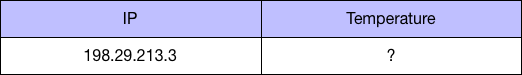
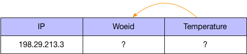
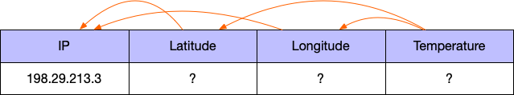

The task of this tutorial is to implement a series of resolvers that can tell the current
temperature, based on some IP address.

To implement this I'll use [GeoJS](https://get.geojs.io) to find the location from some
given IP, and then use [Meta Weather](https://www.metaweather.com) to find the temperature.

## App Setup

In this demo I'll be using [Clojure Deps](https://clojure.org/guides/deps_and_cli) to manage the dependencies:

```clojure title="deps.edn"
{:paths
 ["src"]

 :deps
 {cheshire/cheshire   {:mvn/version "5.10.0"}
  com.wsscode/pathom3 {:git/url "https://github.com/wilkerlucio/pathom3"
                       :sha     "1f3ca76ead855609e0f27b30f6e8bf23b5bcfa0a"}
  org.clojure/clojure {:mvn/version "1.10.0"}}}
```

We are going to use `cheshire` to parse `JSON` from the API responses.

## Command Line Application

To run our application we will use the `:exec-fn` feature from `deps.edn`, I'll start
setting up a main entry point and show how to trigger it from the command line:

```clojure
(ns com.wsscode.pathom3.demos.ip-weather)

(defn main [{:keys [ip]}]
  (println "Request temperature for the IP" ip))
```

To test this, run the following:

```
clj -X com.wsscode.pathom3.demos.ip-weather/main :ip '"198.29.213.3"'
```

To make this command shorter, I can add an alias to `deps.edn`:

```clojure {10-13} title="deps.edn"
{:paths
 ["src"]

 :deps
 {cheshire/cheshire   {:mvn/version "5.10.0"}
  com.wsscode/pathom3 {:git/url "https://github.com/wilkerlucio/pathom3"
                       :sha     "1f3ca76ead855609e0f27b30f6e8bf23b5bcfa0a"}
  org.clojure/clojure {:mvn/version "1.10.0"}}

 ; add alias to make easier to call
 :aliases
 {:ip-weather
  {:exec-fn com.wsscode.pathom3.demos.ip-weather/main}}}
```

Now we can run:

```
clj -X:ip-weather :ip '"198.29.213.3"'
```

Scaffolding done, time to start writing some resolvers.

## Start from the tail

First lets understand the data scenario for this task. If we start assuming we know
nothing about the services involved, we still know what we have (the IP) and what we
want (the temperature), we can start with this graph representation:

<div className="pathom-diagram">

  

</div>

By looking at the documentation on the [Meta Weather API](https://www.metaweather.com/api/),
I see that the temperature information is present in the
`https://www.metaweather.com/api/location/$WOEID$` endpoint (`WOEID` stands for Where On Earth ID)
, under `consolidated_weather` -> `the_temp`. This means that to fetch the temperature, we need some `woeid`.

<div className="pathom-diagram">

  

</div>

Meta Weather provides search endpoints to figure out the `WOEID`:

```
https://www.metaweather.com/api/location/search/?query=san
https://www.metaweather.com/api/location/search/?query=london
https://www.metaweather.com/api/location/search/?lattlong=36.96,-122.02
https://www.metaweather.com/api/location/search/?lattlong=50.068,-5.316
```

To make this example more interesting, we are going to use the one with latitude and
longitude. In this systems, this means that now `WOEID` depends on `latitude` and `longitude`:

<div className="pathom-diagram">

  

</div>

Finally, using the GeoJS API, we can use the endpoint `https://get.geojs.io/v1/ip/geo/$IP$.json`
to figure the latitude and longitude, given some IP:

<div className="pathom-diagram">

  

</div>

Now we have the complete path from the `IP` to the `temperature`.

:::tip
I found those API's using the [Public API's](https://github.com/public-apis/public-apis)
service, I find it a great source to look for open API's to play with.
:::

## Resolvers

:::note
While requesting information with Pathom, it helps to think about the attribute
connections, the resolver names are unimportant most of the time.
:::

To implement the resolvers, I'll start with the one to fetch the latitude and longitude
from the IP, writing a resolver is similar to write a function:

```clojure
(ns com.wsscode.pathom3.demos.ip-weather
  (:require
    [cheshire.core :as json]
    [com.wsscode.pathom3.connect.operation :as pco]))

(pco/defresolver ip->lat-long
  [{:keys [ip]}]
  {::pco/output [:latitude :longitude]}
  (-> (slurp (str "https://get.geojs.io/v1/ip/geo/" ip ".json"))
      (json/parse-string keyword)
      (select-keys [:latitude :longitude])))

(defn main [{:keys [ip]}]
  (println "Request temperature for the IP" ip))
```

To test the resolver in the REPL, I call it, like a function:

```clojure
(ip->lat-long {:ip "198.29.213.3"})
; => {:longitude "-88.0569", :latitude "41.5119"}
```

A resolver is a custom type, here is what's inside:

```clojure
ip->lat-long
; #com.wsscode.pathom3.connect.operation.Resolver
; {:config
;  #:com.wsscode.pathom3.connect.operation
;  {:input [:ip]
;   :provides {:longitude {}
;              :latitude {}}
;   :output [:longitude
;            :latitude]
;   :op-name com.wsscode.pathom3.demos.ip-weather/ip->lat-long},
;
;  :resolve
;  #object[com.wsscode.pathom3.demos.ip_weather$ip__GT_lat_long__17350
;          0x4b7b5266
;          "com.wsscode.pathom3.demos.ip_weather$ip__GT_lat_long__17350@4b7b5266"]}
```

Note that in the configuration map of the resolver, we have the same `::pco/output` as
we wrote in the resolver, the `::pco/input` was inferred from the destructuring used in
the resolver attribute vector.

You can  learn more about the details at [resolvers documentation page](resolvers.mdx).

Now that we have the latitude and longitude, the next resolver will find a `WOEID` from
that:

```clojure {13-21}
(ns com.wsscode.pathom3.demos.ip-weather
  (:require
    [cheshire.core :as json]
    [com.wsscode.pathom3.connect.operation :as pco]))

(pco/defresolver ip->lat-long
  [{:keys [ip]}]
  {::pco/output [:latitude :longitude]}
  (-> (slurp (str "https://get.geojs.io/v1/ip/geo/" ip ".json"))
      (json/parse-string keyword)
      (select-keys [:latitude :longitude])))

(pco/defresolver latlong->woeid
  [{:keys [latitude longitude]}]
  {:woeid
   (-> (slurp
         (str "https://www.metaweather.com/api/location/search/?lattlong="
              latitude "," longitude))
       (json/parse-string keyword)
       first
       :woeid)})

(defn main [{:keys [ip]}]
  (println "Request temperature for the IP" ip))
```

Testing the resolver in the REPL:

```clojure
(latlong->woeid {:longitude "-88.0569", :latitude "41.5119"})
; => {:woeid 2379574}
```

We are getting close, the final step is to find out the temperature, given the `WOEID`:

```clojure {23-30}
(ns com.wsscode.pathom3.demos.ip-weather
  (:require
    [cheshire.core :as json]
    [com.wsscode.pathom3.connect.operation :as pco]))

(pco/defresolver ip->lat-long
  [{:keys [ip]}]
  {::pco/output [:latitude :longitude]}
  (-> (slurp (str "https://get.geojs.io/v1/ip/geo/" ip ".json"))
      (json/parse-string keyword)
      (select-keys [:latitude :longitude])))

(pco/defresolver latlong->woeid
  [{:keys [latitude longitude]}]
  {:woeid
   (-> (slurp
         (str "https://www.metaweather.com/api/location/search/?lattlong="
              latitude "," longitude))
       (json/parse-string keyword)
       first
       :woeid)})

(pco/defresolver woeid->temperature
  [{:keys [woeid]}]
  {:temperature
   (-> (slurp (str "https://www.metaweather.com/api/location/" woeid))
       (json/parse-string keyword)
       :consolidated_weather
       first
       :the_temp)})

(defn main [{:keys [ip]}]
  (println "Request temperature for the IP" ip))
```

To keep our REPL testing in check:

```clojure
(woeid->temperature {:woeid 2379574})
; => {:temperature 4.529999999999999}
```

The whole process chains nicely, starting from `ip` to `temperature`, this is a hint
for what is to come:

```clojure
(-> {:ip "198.29.213.3"}
    ip->lat-long
    latlong->woeid
    woeid->temperature)
; => {:temperature 4.529999999999999}
```
