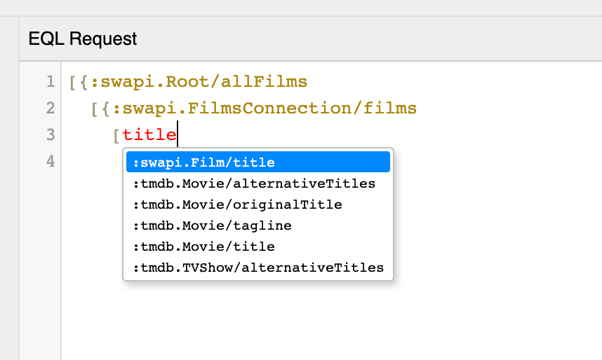
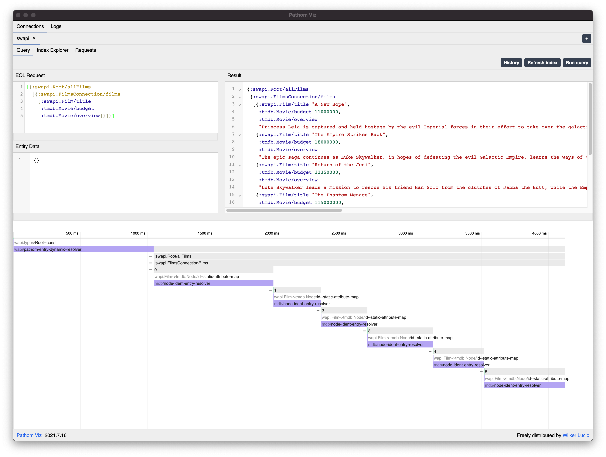

This tutorial will demonstrate how you can consume GraphQL services in Pathom, making
it part of the attribute system.

## Star Wars API

To demonstrate this integration we are going to use the [Star Wars GraphQL API](https://swapi-graphql.netlify.app/)

```clojure
(ns com.wsscode.pathom3.docs.demos.tutorials.graphql
  (:require
    [clojure.data.json :as json]
    [com.wsscode.pathom3.graphql :as p.gql]
    [com.wsscode.pathom3.interface.eql :as p.eql]
    [org.httpkit.client :as http]))

; first a helper function to request GraphQL queries to the Star Wars API
(defn request-swapi-graphql [query]
  (-> @(http/request
         {:url     "https://swapi-graphql.netlify.app/.netlify/functions/index"
          :method  :post
          :headers {"Content-Type" "application/json"
                    "Accept"       "*/*"}
          :body    (json/write-str {:query query})})
      :body
      json/read-str))

; lets create the environment
(def env
  (-> {}
      ; this helper will pull the schema and register it in the environment
      (p.gql/connect-graphql
        {::p.gql/namespace "swapi"}
        request-swapi-graphql)))

(comment
  ; request all people and the title of the films they participate
  (p.eql/process
    env
    [{:swapi.Root/allPeople
      [{:swapi.PeopleConnection/people
        [:swapi.Person/name
         {:swapi.Person/filmConnection
          [{:swapi.PersonFilmsConnection/films
            [:swapi.Film/title]}]}]}]}]))
```

## Federating over multiple GraphQL services

In this part we will see how we can use Pathom to connect data leveraging multiple
GraphQL services.

In this example we are going to use the [TMDB](https://tmdb.apps.quintero.io/) which is an open GraphQL service for
movie data.

Although the SWAPI has some data about the movies, the TMDB has more data, like overview,
images, budget...

So how can we leverage this data to augment the information we have from the SWAPI?

The first thing we need is a way to associate the SWAPI video instance, with a Movie
entry on TMDB.

For this example I'll use a simple table mapping, that maps ids from SWAPI to TMDB.

```clojure
(def swapi-id->tmdb-id
  {"ZmlsbXM6MQ==" "MDoxMQ=="
   "ZmlsbXM6Mg==" "MDoxODkx"
   "ZmlsbXM6Mw==" "MDoxODky"
   "ZmlsbXM6NA==" "MDoxODkz"
   "ZmlsbXM6NQ==" "MDoxODk0"
   "ZmlsbXM6Ng==" "MDoxODk1"})
```

:::note
I got the TMDB id's by manually searching for the Star Wars movies there. You could
as an exercise try to make this more automatic, maybe by using the movie number or
name to search from TMDB.
:::

Now let's include the TMDB setup in our environment and integrate the mapping:

```clojure
; refactor to simplify the definition of a graphql source
(defn graphql-request [url query]
  (-> @(http/request
         {:url     url
          :method  :post
          :headers {"Content-Type" "application/json"
                    "Accept"       "*/*"}
          :body    (json/write-str {:query query})})
      :body
      json/read-str))

; SWAPI request
(def request-swapi
  #(graphql-request "https://swapi-graphql.netlify.app/.netlify/functions/index" %))

; TMDB request
(def request-tmdb
  #(graphql-request "https://tmdb.apps.quintero.io/" %))

(def swapi-id->tmdb-id
  {"ZmlsbXM6MQ==" "MDoxMQ=="
   "ZmlsbXM6Mg==" "MDoxODkx"
   "ZmlsbXM6Mw==" "MDoxODky"
   "ZmlsbXM6NA==" "MDoxODkz"
   "ZmlsbXM6NQ==" "MDoxODk0"
   "ZmlsbXM6Ng==" "MDoxODk1"})

(def env
  (-> {}
      (pci/register
        ; apply the static mapping using a built-in resolver helper
        [(pbir/static-attribute-map-resolver :swapi.Film/id :tmdb.Node/id
           swapi-id->tmdb-id)])
      (p.gql/connect-graphql
        {::p.gql/namespace "swapi"}
        request-swapi)
      (p.gql/connect-graphql
        {::p.gql/namespace "tmdb"
         ::p.gql/ident-map {"node" {"id" ["Node" "id"]}}}
        request-tmdb)
      ; let's integrate pathom viz so we can explore our data, note you need to add the
      ; pathom connector dependency to your project https://github.com/wilkerlucio/pathom-viz-connector
      ((requiring-resolve 'com.wsscode.pathom.viz.ws-connector.pathom3/connect-env)
       "gqldemo")))
```

Using Pathom Viz, we can use the auto-complete to explore our new possibilities:



:::note
The reason we see other types like `TVShow` is due to the fact the entry point for an
entity in TMDB is a generic type called `Node`, which means any type that implements
this interface might be a valid option here, and in this case Pathom will offer all the possible
options.

Pathom will automatically group the attributes when sending to GraphQL using the
`... on TYPE { attr attr2 } ` syntax, and since in Pathom we have the full type name on
each attribute that grouping is based on looking at the last namespace part in the
attribute name.
:::

An example query getting the title from SWAPI, while overview and budget from TMDB:

```clojure
[{:swapi.Root/allFilms
  [{:swapi.FilmsConnection/films
    [:swapi.Film/title
     :tmdb.Movie/budget
     :tmdb.Movie/overview]}]}]
```



:::note
In this scenario we see an N+1 issue. In the future this should be optimized internally
and the same process should be resolved with just one request for each GraphQL
service.

You can track this at: https://github.com/wilkerlucio/pathom3-graphql/issues/11
:::
