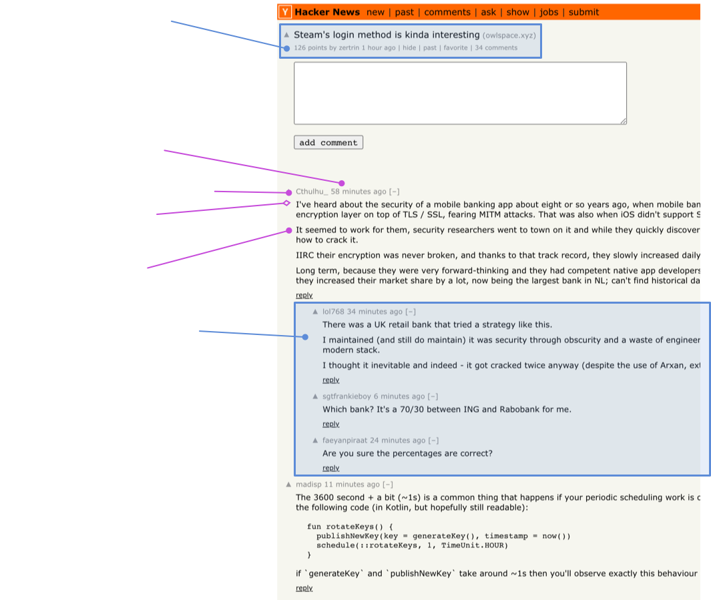

In this tutorial, we are going to write a scraper to extract information from hacker
news pages using Pathom.

Pathom enables declarative programming for data processing.

Using Pathom, we will map out the data from Hacker News in attributes, and then we use
this mapping in various ways to query information.

This scraper will be capable of:

- Listing hacker news pages: news, past, ask
- Read user data
- Read comments from items
- Navigate on pagination

Let's start!

## Attribute mapping

The first step is to make names for every attribute we want to handle.

Here is a quick guide you can follow to help in this process:

1. Pick a general prefix, usually the product/service name. For this case, I'll pick: `hacker-news`.
2. For data points, add some entity context in the name. In the case of Hacker News, I see they call it `item`.
3. If you mean to read collections, give each collection a name.

:::note
If you are developing a product for a company, use the company name for step one.
Avoid having short names like `:user/name` since they have a higher collision chance.
This makes your names much harder to integrate with other names.
:::

Let's see what are the interesting data points to extract from the Hacker News front
page:

<div className="pathom-diagram">

  

</div>

The circle cursors point to visible points of data. The open diamond means the data
is hidden (inside the markup).

I used the name `:hacker-news.page/news` to name the collection of items for this page.

Here is a text version of all the declared attributes:

```clojure
; item attributes
:hacker-news.item/age
:hacker-news.item/author-name
:hacker-news.item/id
:hacker-news.item/comments-count
:hacker-news.item/score
:hacker-news.item/rank-in-page
:hacker-news.item/source
:hacker-news.item/title
:hacker-news.item/url

; news collection
:hacker-news.page/news
```

## Reading the news page

For the implementation, I'll use the [Hickory](https://github.com/davidsantiago/hickory) library to parse the HTML and extract
the data.

To start, we need to explore and figure the code to extract the information fragments
from the HTML page.

I like to start reading the raw HTML and saving it on a `defonce`, so I can keep reloading
the REPL while has a cached version of sample data:

```clojure
(ns com.wsscode.pathom3.docs.demos.tutorials.hacker-news-scrapper)

(defonce sample-html (slurp (str "https://news.ycombinator.com/news")))
```

It's time to learn about the HTML structure of Hacker News page. I like to use the
Chrome inspector to navigate. I can see there is a table with the class `itemlist`
wrapping the item elements.

<div className="pathom-diagram">

  

</div>

### Finding the items

I'll start this query using our data and Hickory and try it on the REPL, I suggest
you follow along in your REPL:

```clojure
(ns com.wsscode.pathom3.docs.demos.tutorials.hacker-news-scrapper
  (:require [hickory.core :as hc]
            [hickory.select :as hs]))

(defonce sample-html (slurp (str "https://news.ycombinator.com/news")))

(comment
  ; navigate to table element
  (->> sample-html
       (hc/parse)
       (hc/as-hickory)
       (hs/select (hs/class "itemlist"))
       first))
```

Now we can extract the rows out. Hacker News doesn't make it straight forward. When I
look at the rows, I see each item uses two table rows. Then it has a spacer row between
the next two with the class `spacer`. To add more details, there is a
different row with the class `morespace` in the end.

To deal with this, we are going to query for rows, removing the ones with the class `spacer`
or `morespace`.

This is how we can do it with Hickory:

```clojure
(comment
  (->> sample-html
       (hc/parse)
       (hc/as-hickory)
       (hs/select (hs/class "itemlist"))
       first
       (hs/select (hs/and
                    (hs/tag "tr")
                    (hs/not (hs/or
                              (hs/class "spacer")
                              (hs/class "morespace")))))
       (partition 2)
       (mapv #(hash-map :type :element :tag :tbody :content (vec %)))))
```

Now we have a collection where each item represents a row in Hacker News.

:::note
After the `partition` the `mapv` is making a fake element for Hickory, this way we
can threat the two rows as a single element for querying in.
:::

### Read item details

Now for each item, we need to extract the attributes we want. Here are a few helpers
we will use for it:

```clojure
(defn find-text
  "Given an element, traverse the contents until it reaches some text."
  [el]
  (loop [item (first (:content el))]
    (if (string? item)
      item
      (if-let [next (some-> item :content first)]
        (recur next)
        nil))))

(defn class-text
  "Get the text for a given element that matches a css class."
  [el class]
  (->> (hs/select (hs/class class) el)
       first
       (find-text)))

(defn select-number
  "Extract the first integer from a string."
  [x]
  (if-let [[_ n] (re-find #"(\d+)" (str x))]
    (Integer/parseInt n)
    0))
```

Here is a function to extract the data points we mentioned at start from each item:

```clojure
(defn extract-item-from-hickory [el]
  {:hacker-news.item/age            (class-text el "age")
   :hacker-news.item/author-name    (class-text el "hnuser")
   :hacker-news.item/comments-count (->> (hs/select (hs/find-in-text #"comments$") el)
                                         first
                                         (find-text)
                                         (select-number))
   :hacker-news.item/score          (select-number (class-text el "score"))
   :hacker-news.item/id             (->> el :content first :attrs :id)
   :hacker-news.item/rank-in-page   (select-number (class-text el "rank"))
   :hacker-news.item/source         (class-text el "sitestr")
   :hacker-news.item/title          (class-text el "storylink")
   :hacker-news.item/url            (->> (hs/select (hs/class "storylink") el)
                                         first :attrs :href)})
```

Let's use it to extract the data from our previous process:

```clojure
(comment
  (->> sample-html
       (hc/parse)
       (hc/as-hickory)
       (hs/select (hs/class "itemlist"))
       first
       (hs/select (hs/and
                    (hs/tag "tr")
                    (hs/not (hs/or
                              (hs/class "spacer")
                              (hs/class "morespace")))))
       (partition 2)
       (mapv #(hash-map :type :element :tag :tbody :content (vec %)))
       (mapv extract-item-from-hickory)))
```

Now you should see the nice plain data in the output, with one map for each
item entry.

## Make a resolver

Time to introduce Pathom, now I'm going to turn that exploration code in a resolver:

```clojure {2-4,47-87}
(ns com.wsscode.pathom3.docs.demos.tutorials.hacker-news-scrapper
  (:require [com.wsscode.pathom3.connect.indexes :as pci]
            [com.wsscode.pathom3.connect.operation :as pco]
            [com.wsscode.pathom3.interface.eql :as p.eql]
            [hickory.core :as hc]
            [hickory.select :as hs]))

(defn find-text
  "Given an element, traverse the contents until it reaches some text."
  [el]
  (loop [item (first (:content el))]
    (if (string? item)
      item
      (if-let [next (some-> item :content first)]
        (recur next)
        nil))))

(defn class-text
  "Get the text for a given element that matches a css class."
  [el class]
  (->> (hs/select (hs/class class) el)
       first
       (find-text)))

(defn select-number
  "Extract the first integer from a string."
  [x]
  (if-let [[_ n] (re-find #"(\d+)" (str x))]
    (Integer/parseInt n)
    0))

(defn extract-item-from-hickory [el]
  {:hacker-news.item/age            (class-text el "age")
   :hacker-news.item/author-name    (class-text el "hnuser")
   :hacker-news.item/comments-count (->> (hs/select (hs/find-in-text #"comments$") el)
                                         first
                                         (find-text)
                                         (select-number))
   :hacker-news.item/score          (select-number (class-text el "score"))
   :hacker-news.item/id             (->> el :content first :attrs :id)
   :hacker-news.item/rank-in-page   (select-number (class-text el "rank"))
   :hacker-news.item/source         (class-text el "sitestr")
   :hacker-news.item/title          (class-text el "storylink")
   :hacker-news.item/url            (->> (hs/select (hs/class "storylink") el)
                                         first :attrs :href)})

(pco/defresolver news-page-html-string []
  {:hacker-news.page/news-raw-html
   (slurp "https://news.ycombinator.com/news")})

(pco/defresolver news-page [{:hacker-news.page/keys [news-raw-html]}]
  {::pco/output
   [{:hacker-news.page/news
     [:hacker-news.item/age
      :hacker-news.item/author-name
      :hacker-news.item/id
      :hacker-news.item/comments-count
      :hacker-news.item/score
      :hacker-news.item/rank-in-page
      :hacker-news.item/source
      :hacker-news.item/title
      :hacker-news.item/url]}]}
  {:hacker-news.page/news
   (->> news-raw-html
        (hc/parse)
        (hc/as-hickory)
        (hs/select (hs/class "itemlist"))
        first
        (hs/select (hs/and
                     (hs/tag "tr")
                     (hs/not (hs/or
                               (hs/class "spacer")
                               (hs/class "morespace")))))
        (partition 2)
        (mapv #(hash-map :type :element :tag :tbody :content (vec %)))
        (mapv extract-item-from-hickory))})

(def env
  (pci/register
    [news-page-html-string
     news-page]))

(comment
  ; get the title of all the news
  (p.eql/process env
    [{:hacker-news.page/news
      [:hacker-news.item/title]}]))
```

Not much yet, but we gained the ability to filter pieces of the results.

:::tip
Some editors like [Cursive](https://cursive-ide.com/) do highlight keywords when your
cursor is over them. You can use this indication to see the inputs connecting with
outputs in the editor.
:::

### Caching the request for development

When we run the process now, it requests hacker news every time. For development
it's useful if we can cache that to have a faster iteration.

You may have noticed I used a separated resolver to fetch the HTML string. We can make
this resolver use a durable cache to speed up the iteration:

```clojure
(pco/defresolver news-page-html-string []
  ; define a custom cache store for this resolver
  {::pco/cache-store ::durable-cache*}
  {:hacker-news.page/news-raw-html
   (slurp "https://news.ycombinator.com/news")})

; defonce to have a durable cache, an atom with a map is a valid empty cache
(defonce cache* (atom {}))

(def env
  ; add our cache to the environment
  (-> {::durable-cache* cache*}
      (pci/register
        [news-page-html-string
         news-page])))
```

Now, if you keep running that expression, it only does the IO on the first time.

:::tip
To clear the cache, run `(reset! cache* {})` in the REPL.
:::

## Traversing pagination

So far, we only read the first page of the news, but there is a `More` button at the
end. Now we are going to scan through these pages.

First we need to adapt the resolver that loads the page html to accept a custom URL
for it:

```clojure
(pco/defresolver news-page-html-string [{:hacker-news.page/keys [news-page-url]}]
  {::pco/cache-store ::durable-cache*
   ::pco/input       [(pco/? :hacker-news.page/news-page-url)]}
  {:hacker-news.page/news-raw-html
   (slurp (or news-page-url "https://news.ycombinator.com/news"))})
```

I used an [optional input](../resolvers.mdx#optional-inputs) named `:hacker-news.page/news-page-url` to allow the
customization, but still have a default.

To provide the data with the URL for the next page, I'll add a new resolver. This resolver
will expose the attribute `:hacker-news.page/news-next-page` that contains the key
`:hacker-news.page/news-page-url`:

```clojure
(pco/defresolver news-next-page [{:hacker-news.page/keys [news-raw-html]}]
  {::pco/output
   [{:hacker-news.page/news-next-page
     [:hacker-news.page/news-page-url]}]}
  (let [link (some->> news-raw-html hc/parse hc/as-hickory
               (hs/select (hs/class "morelink"))
               first :attrs :href)]
    (if link
      {:hacker-news.page/news-next-page
       {:hacker-news.page/news-page-url
        (str "https://news.ycombinator.com/" link)}})))
```

:::tip
You can look at this resolver as an implementation of a linked list. The attribute
`:hacker-news.page/news-next-page` is a link to the next page item. In terms of Pathom,
we make that happen by providing the `:hacker-news.page/news-page-url` in that context, which can navigate
to the next `:hacker-news.page/news-next-page` and so on...
:::

I check if there is a `More` link. Otherwise, we don't return any data to tell Pathom
this is unavailable.

You may notice we now have two resolvers that get the HTML string for the news page
and parse it. Each resolver is doing its parsing. We can make them share this
by breaking this step into a new resolver.

```clojure {1-6,8-9,34-35}
; get the html string and compute hickory
(pco/defresolver news-page-hickory [{:hacker-news.page/keys [news-raw-html]}]
  {:hacker-news.page/news-hickory
   (-> news-raw-html
       (hc/parse)
       (hc/as-hickory))})

; news page now uses the hickory
(pco/defresolver news-page [{:hacker-news.page/keys [news-hickory]}]
  {::pco/output
   [{:hacker-news.page/news
     [:hacker-news.item/age
      :hacker-news.item/author-name
      :hacker-news.item/id
      :hacker-news.item/comments-count
      :hacker-news.item/score
      :hacker-news.item/rank-in-page
      :hacker-news.item/source
      :hacker-news.item/title
      :hacker-news.item/url]}]}
  {:hacker-news.page/news
   (->> news-hickory
        (hs/select (hs/class "itemlist"))
        first
        (hs/select (hs/and
                     (hs/tag "tr")
                     (hs/not (hs/or
                               (hs/class "spacer")
                               (hs/class "morespace")))))
        (partition 2)
        (mapv #(hash-map :type :element :tag :tbody :content (vec %)))
        (mapv extract-item-from-hickory))})

; same for next page
(pco/defresolver news-next-page [{:hacker-news.page/keys [news-hickory]}]
  {::pco/output
   [{:hacker-news.page/news-next-page
     [:hacker-news.page/news-page-url]}]}

  (let [link (some->> news-hickory
               (hs/select (hs/class "morelink"))
               first :attrs :href)]
    (if link
      {:hacker-news.page/news-next-page
       {:hacker-news.page/news-page-url
        (str "https://news.ycombinator.com/" link)}})))
```

This is a crucial design choice when you write Pathom resolvers. How much you want
to break, as you add more resolvers, you expand the connection points to other resolvers.

In general, it is a good practice to keep spread, but it's fine to provide many items
in a resolver when they share a close process. This reduces the amount of work Pathom
has to do to integrate.

Let's play with our new resolvers:

```clojure {6,8}
; remember to update env to include all resolvers
(def env
  (-> {::durable-cache* cache*}
      (pci/register
        [news-page-html-string
         news-page-hickory
         news-page
         news-next-page])))

(comment
  ; get titles from first and second page
  (p.eql/process env
    [{:hacker-news.page/news
      [:hacker-news.item/title]}
     {:hacker-news.page/news-next-page
      [{:hacker-news.page/news
        [:hacker-news.item/title]}]}]))
```

Notice the query inside `:hacker-news.page/news-next-page` is the same used in the
parent query. For this we can use recursive queries, let's say we want to pull the
next three pages:

```clojure
(comment
  (p.eql/process env
    [{:hacker-news.page/news
      [:hacker-news.item/title]}
     ; recurse bounded to 3 steps
     {:hacker-news.page/news-next-page 3}]))
```

How cool is that?! You may be saying now: ok, but that's a weird tree output.

To flat the items out we can use `tree-seq`:

```clojure
(comment
  (->> (p.eql/process env
         [{:hacker-news.page/news
           [:hacker-news.item/title]}
          ; recurse bounded to 3 steps
          {:hacker-news.page/news-next-page 3}])
       (tree-seq :hacker-news.page/news-next-page
         ; we need vector at the end because tree-seq expects children to be a collection
         (comp vector :hacker-news.page/news-next-page))
       ; mapcat the news to have a single flat list
       (into [] (mapcat :hacker-news.page/news))))
```

:::note
Recursive queries can be numbers (bounded) or a symbol ... (unbounded). If you use the
unbounded, it will pull pages until Hacker News is over with them. During the time
I tested there were 21 pages. If you try, it may take some time to finish.
:::

Pathom also supports [nested inputs](../resolvers.mdx#nested-inputs), this means we can create a resolver to make that
same process we did with the query before:

```clojure {12-13}
(pco/defresolver all-news-pages [input]
  {::pco/input  [{:hacker-news.page/news
                  [:hacker-news.item/age
                   :hacker-news.item/author-name
                   :hacker-news.item/id
                   :hacker-news.item/comments-count
                   :hacker-news.item/score
                   :hacker-news.item/rank-in-page
                   :hacker-news.item/source
                   :hacker-news.item/title
                   :hacker-news.item/url]}
                 ; note the recursive query here
                 {:hacker-news.page/news-next-page '...}]
   ::pco/output [{:hacker-news.page/news-all-pages
                  [:hacker-news.item/age
                   :hacker-news.item/author-name
                   :hacker-news.item/id
                   :hacker-news.item/comments-count
                   :hacker-news.item/score
                   :hacker-news.item/rank-in-page
                   :hacker-news.item/source
                   :hacker-news.item/title
                   :hacker-news.item/url]}]}
  {:hacker-news.page/news-all-pages
   (->> input
        (tree-seq :hacker-news.page/news-next-page
          (comp vector :hacker-news.page/news-next-page))
        (into [] (mapcat :hacker-news.page/news)))})
```

Now we can, for example, make this query to read all titles in news, in all pages:

```clojure
(comment
  ; this can take a while
  (->> (p.eql/process env
         [{:hacker-news.page/news-all-pages
           [:hacker-news.item/title]}])))
```

## Read user data

Let's look at the user page this time:

<div className="pathom-diagram">

  

</div>

Similar to before, but this time we require some user id to load the page. The arrows
show that the same attribute we read on the page as `:hacker-news.user/id` is used
in the URL to load the page.

Here are the resolvers to parse this:

```clojure
(pco/defresolver user-data-hickory [{:keys [hacker-news.user/id]}]
  ; also use the durable cache here
  {::pco/cache-store ::durable-cache*}
  {:hacker-news.page/user-hickory
   (some-> (slurp (str "https://news.ycombinator.com/user?id=" id))
     hc/parse hc/as-hickory)})

(pco/defresolver user-data [{:hacker-news.page/keys [user-hickory]}]
  {:hacker-news.user/karma
   (->> user-hickory
        (hs/select
          (hs/and
            (hs/tag "tr")
            (hs/has-child (hs/find-in-text #"karma:"))))
        first :content second :content select-number)

   :hacker-news.user/join-date
   (let [str (->> user-hickory
                  (hs/select
                    (hs/and
                      (hs/tag "tr")
                      (hs/has-child (hs/find-in-text #"created:"))))
                  first :content second :content first :attrs :href)
         [_ date] (re-find #"(\d{4}-\d{2}-\d{2})" str)]
     date)})
```

Note we also use the durable cache, so we can keep playing it. When I created this I
was hitting the same cache entry until I got the extraction code right.

:::important
You may have noticed that we now have two different attributes that mean user id.
We have `:hacker-news.item/author-name` and now `:hacker-news.user/id`. If we try to load the karma for the user in the HN item, it won't be able to get there.

One idea is to change our previous resolver and rename `:hacker-news.item/author-name`
to `:hacker-news.user/id`. This would work, but this reduces the accuracy of this name
semantics. `:hacker-news.item/author-name` has a precise meaning. It's the author's
name in an item.

To reconcile this situation, we can create an [alias-resolver](../built-in-resolvers.mdx#aliasing),
that allows Pathom to navigate from one name to another. This is what I'm going to
use next.

It's also good to point out that aliases are directional. We are allowing
`:hacker-news.item/author-name` to be translated in `:hacker-news.user/id`, but not
the reverse.
:::

Let's see who has the most karma from the front-page:

```clojure
; update env
(def env
  (-> {::durable-cache* cache*}
      (pci/register
        [; alias the author name to id
         (pbir/alias-resolver :hacker-news.item/author-name :hacker-news.user/id)
         news-page-html-string
         news-page-hickory
         news-page
         news-next-page
         user-data-hickory
         user-data])))

(comment
  (->> (p.eql/process env
         [{:hacker-news.page/news
           [:hacker-news.item/author-name
            :hacker-news.user/karma]}])
       :hacker-news.page/news
       (sort-by :hacker-news.user/karma #(compare %2 %))))
```

## Read comments

Let's map the comments section:

<div className="pathom-diagram">

  

</div>

We can see at the top we have almost the same data as we did on the news list, except
the rank position (which makes sense since it's relative to that page).

Let's start writing a resolver that can read this information given some item id:

```clojure
; load page as hickory, use our durable cache
(pco/defresolver item-page-hickory [{:hacker-news.item/keys [id]}]
  {::pco/cache-store ::durable-cache*}
  {:hacker-news.page/item-hickory
   (->> (slurp (str "https://news.ycombinator.com/item?id=" id))
        hc/parse hc/as-hickory)})

(pco/defresolver item-data [{:hacker-news.page/keys [item-hickory]}]
  {::pco/output
   [:hacker-news.item/age
    :hacker-news.item/author-name
    :hacker-news.item/comments-count
    :hacker-news.item/score
    :hacker-news.item/source
    :hacker-news.item/title
    :hacker-news.item/url]}
  ; let's re-use our same extraction function, fatitem class is the container at
  ; this page
  (extract-item-from-hickory (->> (hs/select (hs/class "fatitem") item-hickory)
                                  first)))
```

That's easy enough—time for the comments.

By looking at the page we can see comments are nested, and altough this example isn't
showing, they also support deep nesting.

Most of the time, the HTML will follow the structure of the data, but this isn't the
case here.

Try inspecting the page. You will see they use a flat table and manually add the
spacings to convey the nesting.

This means we need to do more work to reconstruct the tree from a flat structure.

Let's do that in parts. First, let's extract it in a closer way to what we have: a flat structure. On top of the data I mentioned in the image, we now will
also add a `:hacker-news.comment/ident`, which tells us the row's indentation level. Later I'll use this to transform the list into a tree.

```clojure
(defn comment-ident-level [el]
  (-> (hs/select (hs/and (hs/tag "img") (hs/attr "src" #{"s.gif"})) el)
      first :attrs :width select-number (/ 40)))

(defn extract-comment [el]
  {:hacker-news.comment/id          (-> el :attrs :id)
   :hacker-news.comment/age         (class-text el "age")
   :hacker-news.comment/author-name (class-text el "hnuser")
   :hacker-news.comment/indent      (comment-ident-level el)
   :hacker-news.comment/content     (->> (hs/select (hs/class "comment") el)
                                         first :content (keep find-text) (str/join "\n"))})

(pco/defresolver item-comments-flat [{:hacker-news.page/keys [item-hickory]}]
  {::pco/output [{:hacker-news.item/comments-flat
                  [:hacker-news.comment/author-name
                   :hacker-news.comment/age
                   :hacker-news.comment/content
                   :hacker-news.comment/id
                   :hacker-news.comment/indent]}]}
  {:hacker-news.item/comments-flat
   (->> item-hickory
        (hs/select (hs/class "comtr"))
        (mapv extract-comment))})
```

We can test that with (remember to add all resolvers to the env):

```clojure
(comment
  ; get all comments author names
  (p.eql/process env
    {:hacker-news.item/id "25733200"}
    [{:hacker-news.item/comments-flat
      [:hacker-news.comment/author-name]}]))
```

Now it's time to transform the list into a tree.

To think about this process, let's use make up some example data and how it should be
transformed:

```clojure
; first, visually, it looks like this:
; 1
; | 2
; | 3
; 4
; | 5
; | | 6

; we have a list like this, with ids and indentations, the rest of the data we can ignore
; for the purpose of this transformation
[{:id 1 :ident 0}
 {:id 2 :ident 1}
 {:id 3 :ident 1}
 {:id 4 :ident 0}
 {:id 5 :ident 1}
 {:id 6 :ident 2}]

; and our goal is to transform that into:
[{:id 1
  :children [{:id 2}
             {:id 3}]}
 {:id 4
  :children [{:id 5
              :children [{:id 6}]}]}]
```

To do this, we have to go over the list and remember past items. My idea to remember the
current level is: When it goes up, add an item to a stack. When it goes down, remove it from the
stack. The stack will contain the ids of the parent items. As I scan, I'll also add
the items to a list, indexed by ID. This way, I can modify any item at any time with ease.

I decided it would be fun to use Pathom as part of this process too, and it's nice the
things I discussed already feel like a graph.

This is the code:

```clojure
(pco/defresolver item-comments [{:hacker-news.item/keys [comments-flat]}]
  {::pco/output
   [{:hacker-news.item/comments
     [:hacker-news.comment/author-name
      :hacker-news.comment/age
      :hacker-news.comment/content
      :hacker-news.comment/id
      {:hacker-news.comment/responses '...}]}]}
  (let [{:keys [roots index]}
        (->> comments-flat
             (reduce
               (fn [{:keys [level prev] :as acc} {:hacker-news.comment/keys [id indent] :as comment}]
                 (let [{:keys [stack] :as acc} (cond-> acc
                                                 (> indent level)
                                                 (update :stack conj prev)

                                                 (< indent level)
                                                 (update :stack pop))
                       stack-head (peek stack)]
                   (cond-> acc
                     true
                     (-> (update :index assoc id comment)
                         (assoc :level indent)
                         (assoc :prev id))

                     (zero? indent)
                     (update :roots conj comment)

                     (pos? indent)
                     (update-in [:index stack-head :hacker-news.comment/responses]
                       coll/vconj {:hacker-news.comment/id id}))))
               {:stack []
                :roots []
                :index {}
                :level 0
                :prev  nil}))]
    ; empty index when there are no comments
    (if (seq index)
      ; use pathom to transform the query in a tree
      (->> (p.eql/process
             (pci/register [(pbir/static-table-resolver :hacker-news.comment/id index)
                            (pbir/constantly-resolver :roots roots)])
             [{:roots [:hacker-news.comment/author-name
                       :hacker-news.comment/age
                       :hacker-news.comment/content
                       :hacker-news.comment/id
                       {:hacker-news.comment/responses '...}]}])
           :roots
           ; always remember to wrap the sequence in the named output
           (hash-map :hacker-news.item/comments))
      {:hacker-news.item/comments []})))
```

Usage demo:

```clojure
; lets recap what our env is like with all of the things
(def env
  (-> {::durable-cache* cache*}
      (pci/register
        [(pbir/alias-resolver :hacker-news.item/author-name :hacker-news.user/id)
         ; add this new one to also alias from comment author name
         (pbir/alias-resolver :hacker-news.comment/author-name :hacker-news.user/id)
         news-page-html-string
         news-page-hickory
         news-page
         news-next-page
         all-news-pages
         user-data-hickory
         user-data
         item-page-hickory
         item-data
         item-comments-flat
         item-comments])))

(comment
  ; the same we did before, but this time we will only see the top level comments
  (p.eql/process env
    {:hacker-news.item/id "25733200"}
    [{:hacker-news.item/comments
      [:hacker-news.comment/author-name]}]))

(comment
  ; now, get the whole structured comments, and also include the karma of each user
  ; on it
  (p.eql/process env
    {:hacker-news.item/id "25733200"}
    [{:hacker-news.item/comments
      [:hacker-news.comment/author-name
       :hacker-news.user/karma
       {:hacker-news.comment/responses '...}]}]))

(comment
  ; WARNING: this will trigger a lot of requests, may take some time. Also, HN may
  ; throttle or block some accesses from you.
  (p.eql/process env
    [{:hacker-news.page/news
      [:hacker-news.item/age
       :hacker-news.item/author-name
       :hacker-news.item/id
       :hacker-news.item/comments-count
       :hacker-news.item/score
       :hacker-news.item/rank-in-page
       :hacker-news.item/source
       :hacker-news.item/title
       :hacker-news.item/url

       :hacker-news.user/id
       :hacker-news.user/karma
       :hacker-news.user/join-date

       {:hacker-news.item/comments
        [:hacker-news.comment/author-name
         :hacker-news.comment/age
         :hacker-news.comment/content
         :hacker-news.comment/id

         :hacker-news.user/id
         :hacker-news.user/karma
         :hacker-news.user/join-date

         {:hacker-news.comment/responses '...}]}]}]))
```

## Playing with Smart Maps

Let's do a pause on implementing HN things and play a bit with what we have.

In the previous examples we requested information using the [EQL interface](../eql.mdx). The
EQL is the most efficient and precise way to use Pathom because in this way, Pathom
can look at a full-size request and optimize as much as possible.

I'll now introduce [Smart Maps](../smart-maps.mdx) for our play here, which is a different interface to use
Pathom 3. Smart Maps are a data structure that works like Clojure maps, but when you
access some key that the map doesn't know the value, it uses the Pathom resolvers to
figure out (when possible).

To this demo I'll start with some item id and fetch some data:

```clojure
(-> (psm/smart-map env {:hacker-news.item/id "25733200"})
    :hacker-news.item/title)
=> "OpenSocial Specification"
```

Cool right?! You may be asking now: how do you know what is accessible?

To answer that you can leverage the `datafy` protocol implemented by Pathom Smart Maps:

```clojure
(-> (psm/smart-map env {:hacker-news.item/id "25733200"})
    clojure.datafy/datafy)
=>
{:hacker-news.item/age :com.wsscode.pathom3.connect.operation/unknown-value
 :hacker-news.item/author-name :com.wsscode.pathom3.connect.operation/unknown-value
 :hacker-news.item/comments :com.wsscode.pathom3.connect.operation/unknown-value
 :hacker-news.item/comments-count :com.wsscode.pathom3.connect.operation/unknown-value
 :hacker-news.item/comments-flat :com.wsscode.pathom3.connect.operation/unknown-value
 :hacker-news.item/id "25733200"
 :hacker-news.item/score :com.wsscode.pathom3.connect.operation/unknown-value
 :hacker-news.item/source :com.wsscode.pathom3.connect.operation/unknown-value
 :hacker-news.item/title :com.wsscode.pathom3.connect.operation/unknown-value
 :hacker-news.item/url :com.wsscode.pathom3.connect.operation/unknown-value
 :hacker-news.page/item-hickory :com.wsscode.pathom3.connect.operation/unknown-value
 :hacker-news.page/news :com.wsscode.pathom3.connect.operation/unknown-value
 :hacker-news.page/news-all-pages :com.wsscode.pathom3.connect.operation/unknown-value
 :hacker-news.page/news-hickory :com.wsscode.pathom3.connect.operation/unknown-value
 :hacker-news.page/news-next-page :com.wsscode.pathom3.connect.operation/unknown-value
 :hacker-news.page/news-raw-html :com.wsscode.pathom3.connect.operation/unknown-value
 :hacker-news.page/user-hickory :com.wsscode.pathom3.connect.operation/unknown-value
 :hacker-news.user/id :com.wsscode.pathom3.connect.operation/unknown-value
 :hacker-news.user/join-date :com.wsscode.pathom3.connect.operation/unknown-value
 :hacker-news.user/karma :com.wsscode.pathom3.connect.operation/unknown-value}
```

There we can see many attributes related to the item (given we provided an item id). Also,
you can see all the pages, and some user data (because of the relationship from item to
the user).

:::important
The options offered by the Smart Map datafy are contextual. This means if you change
the data you may get different possible paths.
:::

To some REPL play with it, here are some suggestions:

```clojure
; author karma from item 25733200
(-> (psm/smart-map env {:hacker-news.item/id "25733200"})
    :hacker-news.user/karma)

; author and content of first comment of the first post on news
(-> (psm/smart-map env {})
    :hacker-news.page/news
    first
    :hacker-news.item/comments
    first
    (select-keys [:hacker-news.comment/author-name
                  :hacker-news.comment/content
                  :hacker-news.user/join-date]))
```

:::tip
Value responses to smart maps are also smart maps. This is what allows the navigation
like you have seen before. This also means you can datafy at any point to see what paths
are available, for example:

```clojure
(-> (psm/smart-map env {})
    :hacker-news.page/news
    first
    clojure.datafy/datafy)
```
:::

## Other pages

So far, we extracted some details and the news page. Other pages like `past` and `ask`
are quite similar.

This is the list of resolvers we have to deal with on the news page:

```clojure
news-page-html-string
news-page-hickory
news-page
news-next-page
all-news-pages
```

For the `past` page, I'll simplify that, make the same resolver request the HTML and
parse it, as we did for comments and user details.

```clojure
(defn extract-items-from-list [hickory]
  (let [tbody (->> hickory
                   (hs/select (hs/class "itemlist"))
                   first
                   (hs/select (hs/tag "tbody"))
                   first)
        tbody (update tbody :content
                #(into []
                       (drop-while
                         (fn [e]
                           (let [cls (some-> e :attrs :class)]
                             (not= cls "athing"))))
                       %))]

    (->> tbody
         (hs/select (hs/and
                      (hs/tag "tr")
                      (hs/not (hs/or
                                (hs/class "spacer")
                                (hs/class "morespace")))))
         (partition 2)
         (mapv #(hash-map :type :element :tag :tbody :content (vec %)))
         (mapv extract-item-from-hickory))))

(defn extract-more-link [hickory]
  (some->> hickory
    (hs/select (hs/class "morelink"))
    first :attrs :href))

(pco/defresolver past-page-hickory [{:hacker-news.page/keys [past-page-url]}]
  {::pco/cache-store ::durable-cache*
   ::pco/input       [(pco/? :hacker-news.page/past-page-url)]}
  {:hacker-news.page/past-hickory
   (-> (or past-page-url "https://news.ycombinator.com/front")
       slurp
       (hc/parse)
       (hc/as-hickory))})

(pco/defresolver past-page [{:hacker-news.page/keys [past-hickory]}]
  {::pco/output
   [{:hacker-news.page/past
     [:hacker-news.item/age
      :hacker-news.item/author-name
      :hacker-news.item/id
      :hacker-news.item/comments-count
      :hacker-news.item/score
      :hacker-news.item/rank-in-page
      :hacker-news.item/source
      :hacker-news.item/title
      :hacker-news.item/url]}]}
  {:hacker-news.page/past
   (extract-items-from-list past-hickory)})

(pco/defresolver past-next-page [{:hacker-news.page/keys [past-hickory]}]
  {::pco/output
   [{:hacker-news.page/past-next-page
     [:hacker-news.page/past-page-url]}]}

  (if-let [link (extract-more-link past-hickory)]
    {:hacker-news.page/past-next-page
     {:hacker-news.page/past-page-url
      (str "https://news.ycombinator.com/" link)}}))
```

If we compare with the news resolvers, they are almost the same. The differences are:

- The resolver names are different
- The attribute names they are used for the collection node are different
- The initial page uses a different URL
- The table with items has some stuff before the actual first item. Our new implementation skips those.

This similarity can make you feel like there is some higher-order thing to do here.
Especially when we consider that the `ask` page will be another instance of the same
situation.

We can generalize this by writing a function that returns some resolvers, let's replace
our `past` page implementation with this idea:

```clojure
(defn hn-page-resolvers [page-name base-url]
  (let [hickory-sym   (symbol "hacker-news.resolvers.page" (str page-name "-hickory"))
        page-sym      (symbol "hacker-news.resolvers.page" page-name)
        next-page-sym (symbol "hacker-news.resolvers.page" (str page-name "-next-page"))

        hickory-kw    (keyword "hacker-news.page" (str page-name "-hickory"))
        page-kw       (keyword "hacker-news.page" page-name)
        next-page-kw  (keyword "hacker-news.page" (str page-name "-next-page"))
        page-url-kw   (keyword "hacker-news.page" (str page-name "-page-url"))]
    [(pco/resolver hickory-sym
       {::pco/cache-store ::durable-cache*
        ::pco/input       [(pco/? page-url-kw)]
        ::pco/output      [hickory-kw]}
       (fn [_ input]
         {hickory-kw
          (-> (or (get input page-url-kw) base-url)
              slurp
              (hc/parse)
              (hc/as-hickory))}))

     (pco/resolver page-sym
       {::pco/input
        [hickory-kw]

        ::pco/output
        [{page-kw
          [:hacker-news.item/age
           :hacker-news.item/author-name
           :hacker-news.item/id
           :hacker-news.item/comments-count
           :hacker-news.item/score
           :hacker-news.item/rank-in-page
           :hacker-news.item/source
           :hacker-news.item/title
           :hacker-news.item/url]}]}
       (fn [_ input]
         {page-kw
          (extract-items-from-list (get input hickory-kw))}))

     (pco/resolver next-page-sym
       {::pco/input
        [hickory-kw]

        ::pco/output
        [{next-page-kw
          [page-url-kw]}]}
       (fn [_ input]

         (if-let [link (extract-more-link (get input hickory-kw))]
           {next-page-kw
            {page-url-kw
             (str "https://news.ycombinator.com/" link)}})))]))
```

Now we have a function that returns 3 resolvers in a vector. We can now use this to
define some pages:

```clojure {12-16}
(def env
  (-> {::durable-cache* cache*}
      (pci/register
        [(pbir/alias-resolver :hacker-news.item/author-name :hacker-news.user/id)
         (pbir/alias-resolver :hacker-news.comment/author-name :hacker-news.user/id)
         news-page-html-string
         news-page-hickory
         news-page
         news-next-page
         all-news-pages

         ; this is different than news, news is the home, newest are the most recent
         (hn-page-resolvers "newest" "https://news.ycombinator.com/newest")
         (hn-page-resolvers "past" "https://news.ycombinator.com/front")
         (hn-page-resolvers "ask" "https://news.ycombinator.com/ask")
         (hn-page-resolvers "show" "https://news.ycombinator.com/show")

         user-data-hickory
         user-data

         item-page-hickory
         item-data
         item-comments-flat
         item-comments])))
```

:::note
`pci/register` accepts nested vectors as definitions. It flattens the structure out
in the process of registration.
:::

Just like that, we have four new pages implemented!

## Review

That's it for this tutorial, a recap of what we saw here:

- Design attribute names for Hacker News data
- Use Hickory to parse HTML data
- Create resolvers to connect the system
- Use recursive queries to traverse pagination
- Use optional inputs
- Use nested queries with recursive inputs
- Smart Maps exploration
- Creates resolvers dynamically using functions

I hope you learned some new things about Pathom 3 in the process.

You can find the complete source code for this demo at: https://github.com/wilkerlucio/pathom3-docs/blob/master/src/main/com/wsscode/pathom3/docs/demos/tutorials/hacker_news_scrapper.clj

## Exercises

If you like to keep playing, here are some suggestions to add:

- Parse comments back, linking back to the items they point to
- Make relationships from the user to its submissions, comments, and favorites
- Support logging in user and they use mutations to implement voting or submission of new entries
- Replace the HTML parsing implementation with the [Hacker News API](https://github.com/HackerNews/API)
